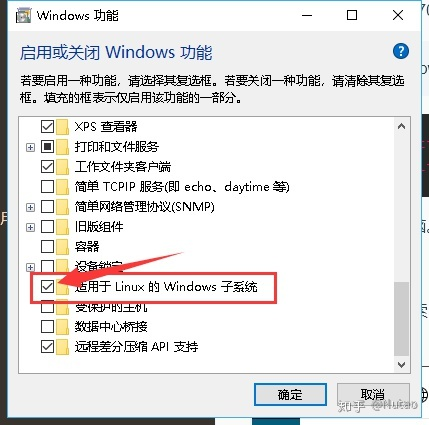
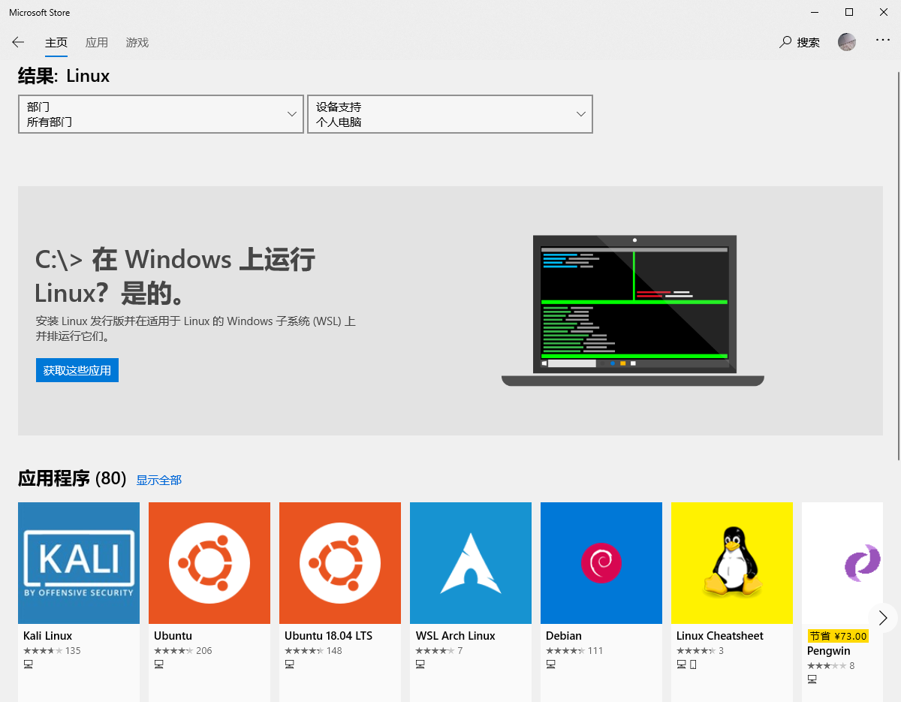
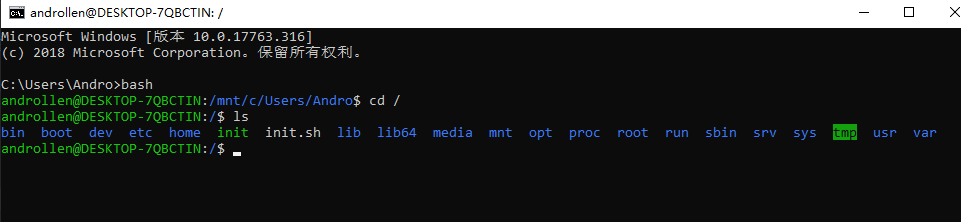
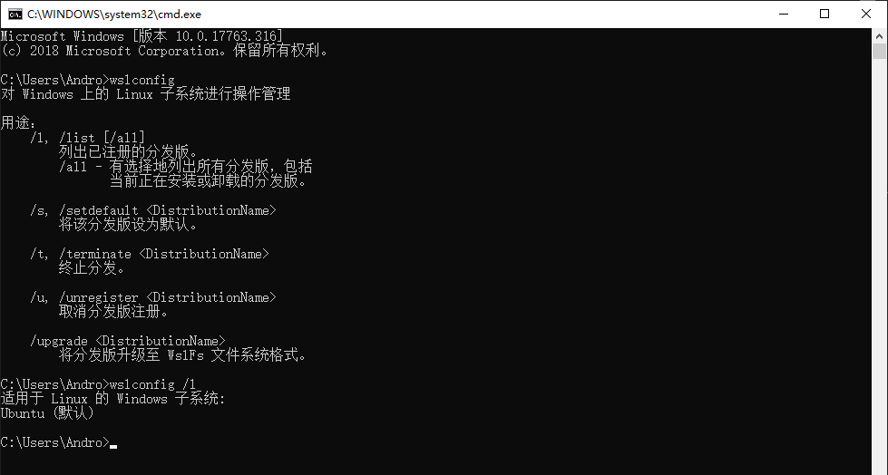

# 安装WSL

* 命令行启用WSL
    > 用管理员方式打开PowerShell 然后运行如下命令  
    > Enable-WindowsOptionalFeature -Online -FeatureName Microsoft-Windows-Subsystem-Linux

* 控制面板启用 WSL
    > 控制面板\程序\程序和功能  
    > 
* [安装WSL](https://docs.microsoft.com/zh-cn/windows/wsl/install-win10)
    > 使用 win10 自带的Microsoft Store应用商店搜索WSL，然后选择自己想要安装的Linux发行版。点击获取，就会自动开始在win10中下载,WSL只能安装在C盘里面  
    > 

* [打开WSL](https://docs.microsoft.com/zh-cn/windows/wsl/initialize-distro)  
    首次打开后会提示正在安装......  
    接着会让配置用户和密码  
    > 如果习惯使用CMD或者PowerShell的童鞋也可以直接在命令提示符中输入 bash 直接开启WSL。  
    > 

* 使用wslconfig命令

    ``` sh
    # 设置默认运行的linux系统
    wslconfig /setdefault 正如上面所说，如果执行wslconfig /setdefault ubuntu，那么执行bash命令则会运行ubuntu

    # 卸载linux系统
    wslconfig /unregister 当系统出现问题，我们可以卸载后重新安装。如：wslconfig /unregeister ubuntu

    # 查看已安装的linux系统
    wslconfig /list
    ```

    

## 链接  

  [官网安装](https://tutorials.ubuntu.com/tutorial/tutorial-ubuntu-on-windows)  
  [官网Ubuntu 镜像](https://www.ubuntu.com/download/desktop)  
  [官网Ubuntu 镜像源](https://packages.ubuntu.com/)
