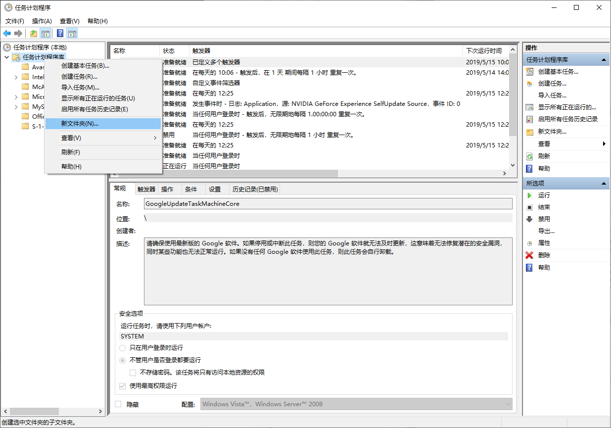
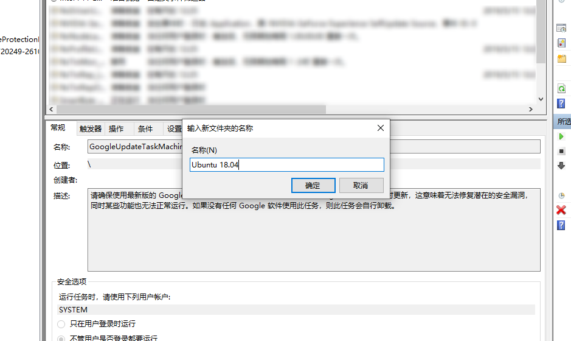
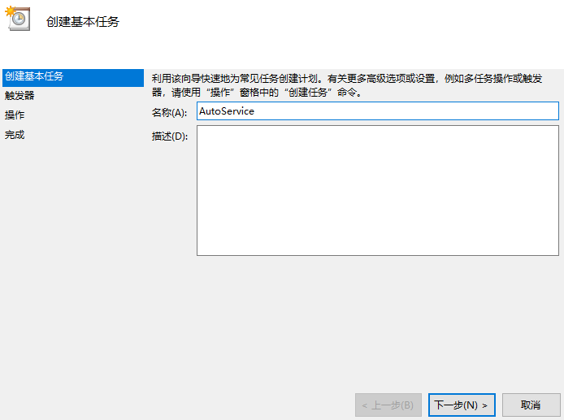
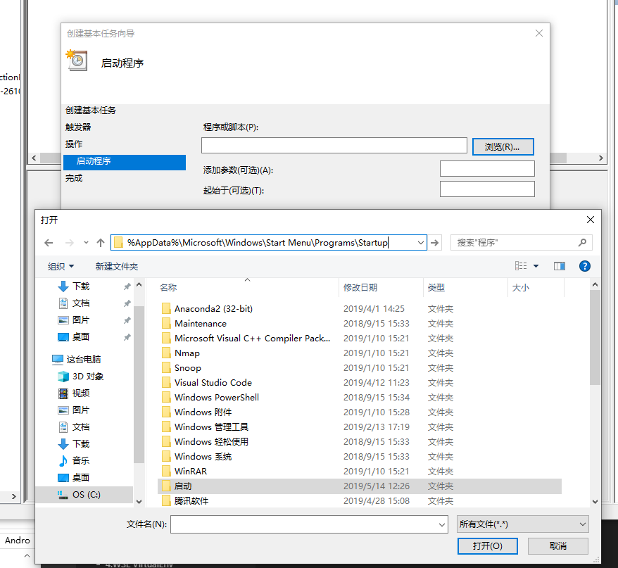
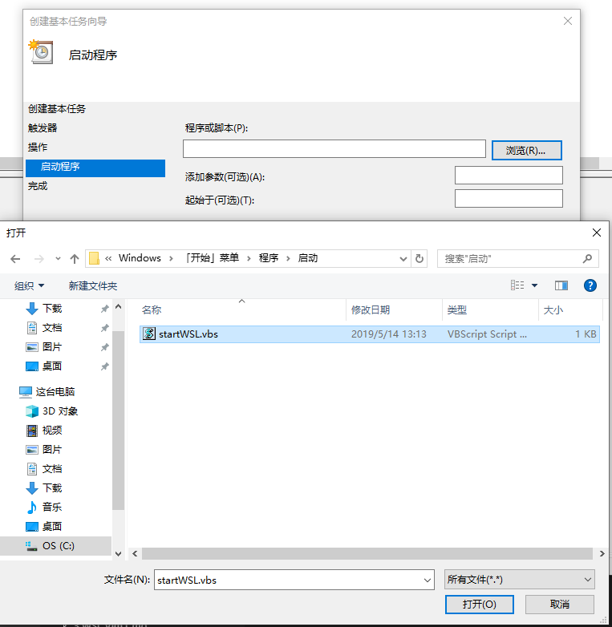
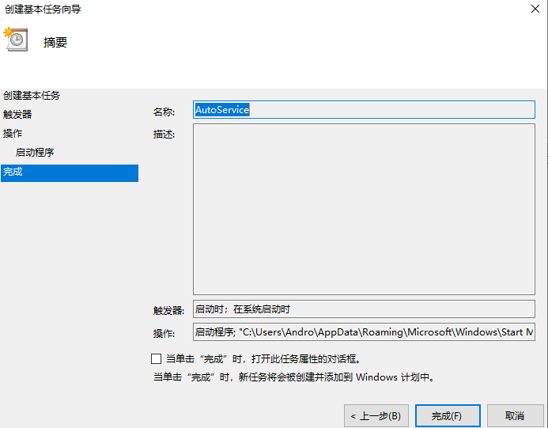

# Windows10子系统Ubuntu使用 SSH 登陆

- 切换到ssh配置文件的位置

  cd /etc/ssh

  ```sh
  # 先把原来的备份
  sudo cp sshd_config sshd_config.bak
  # 先把原来的备份
  sudo cp ssh_config ssh_config.bak
  # 编辑配置文件
  sudo vim sshd_config
  ```

- 修改sshd_config配置

  先查看下本地 Windows10 sshd server是否打开：

  - 没有打开

    ```sh
    # 修改端口
    Port 22
    # 打开本地监听
    ListenAddress 127.0.0.1
    or
    # 打开局域网监听
    ListenAddress 0.0.0.0
    # 修改登陆的方式，允许密码登陆
    PasswordAuthentication yes
    ```

  - 打开

    ```sh
    # 修改端口，原来的22端口已经存在
    Port 2232
    # 打开本地监听
    ListenAddress 127.0.0.1
    or
    # 打开局域网监听
    ListenAddress 0.0.0.0
    # 修改登陆的方式，允许密码登陆
    PasswordAuthentication yes
    ```

- 启动SSH

  sudo service ssh start

  ```sh
  # 会出现找不到host key
  sshd: no hostkeys available -- exiting.
  # 或者
  Could not load host key: /etc/ssh/ssh_host_rsa_key
  Could not load host key: /etc/ssh/ssh_host_ecdsa_key
  Could not load host key: /etc/ssh/ssh_host_ed25519_key
  ```

- 重新生成 host key

  sudo dpkg-reconfigure openssh-server

- 重新启动SSH

  sudo service ssh restart

- [设置用户名高亮](https://www.linuxidc.com/Linux/2017-10/147438.htm)

  ```sh
  echo "export PS1='[\e[32;40m\e[1m\u\e[32;40m\e[1m@\e[32;40m\e[1m\h\e[0m \e[32;40m\e[1m\W\e[0m]\$'" >> .bashrc
  source .bashrc
  ```

- 配置SSH自动启动

  sudo systemctl enable ssh

- check ssh auto status

  sudo systemctl is-enabled ssh

- 运行为windows后台进程

  当前WSL并不支持ssh server作为服务运行。
  [文件下载][wslvbs_id]

  ```sh
  set ws=wscript.createobject("wscript.shell")
  cmd = "C:\Windows\System32\bash.exe -c 'sudo /usr/sbin/service ssh start'"
  ws.run cmd,0
  ```

  1. cd %AppData%\Microsoft\Windows\Start Menu\Programs\Startup or Win + R -> shell:startup
  2. 将上面的脚本，保存为 startWSL.vbs

  > 上述脚本存在一个问题，就是执行sudo时，会提示输入密码，而这时又无法拿到用户的输入。要解决这一问题，需要允许sudo在没有密码的情况下执行命令。
  > 我们需要借助windows计划任务和脚本，使得在windows启动时自动运行这一服务。

- 添加 sudo 无密码权限：

  ```sh
  #includedir /etc/sudoers.d
  $username ALL=(ALL) NOPASSWD: /usr/sbin/service
  ```

  这里的$username即wsl子系统中的一个用户名。我使用了安装wsl时给出的一个用户名

  1. cd C:\Users\\%USERNAME%\AppData\Local\Packages\CanonicalGroupLimited.UbuntuonWindows_79rhkp1fndgsc\LocalState\rootfs\etc
  1. start .
  1. 将上面的脚本,插入至 sudoers

- 打开任务计划程序

  1. Win + R
  2. taskschd.msc
  3. 
  4. 
  5. 
  6. 
  7. 
  8. 
  9. [文件下载][taskvbs_id]
  10. 或者选择导入

- 重启 Windows

## 相关连接

[在wsl下安装使用sshd全攻略](https://hbaaron.github.io/blog_2017/%E5%9C%A8wsl%E4%B8%8B%E5%AE%89%E8%A3%85%E4%BD%BF%E7%94%A8sshd%E5%85%A8%E6%94%BB%E7%95%A5)  
[使用xshell登陆](https://blog.csdn.net/tengchengbaba/article/details/85481145)  
[https://www.cnblogs.com/seekwind/p/10256262.html](https://www.cnblogs.com/seekwind/p/10256262.html)  
[https://www.cnblogs.com/ACDIV/p/9047825.html](https://www.cnblogs.com/ACDIV/p/9047825.html)

[wslvbs_id]: Assets/startWSL.vbs
[taskvbs_id]: Assets/AutoService.xml
