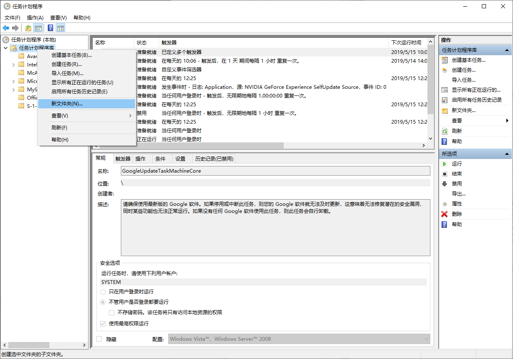
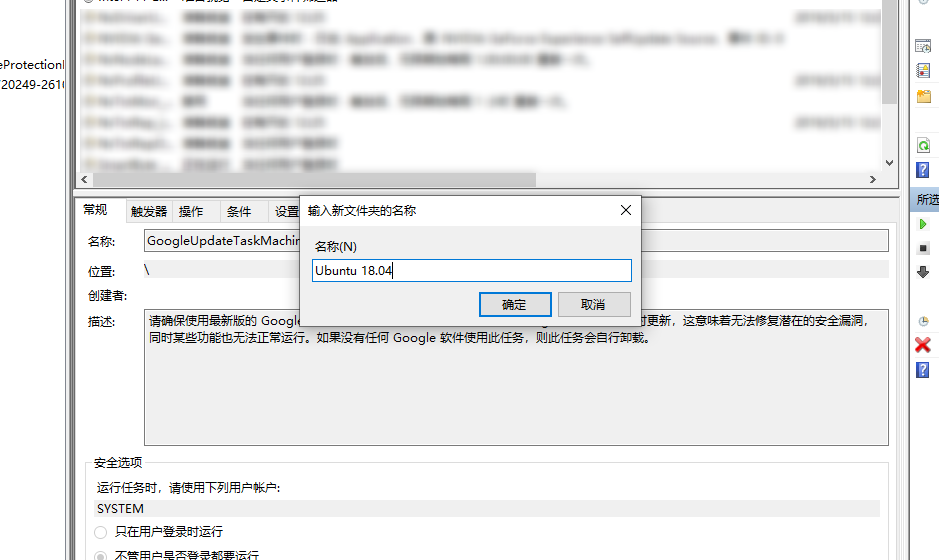
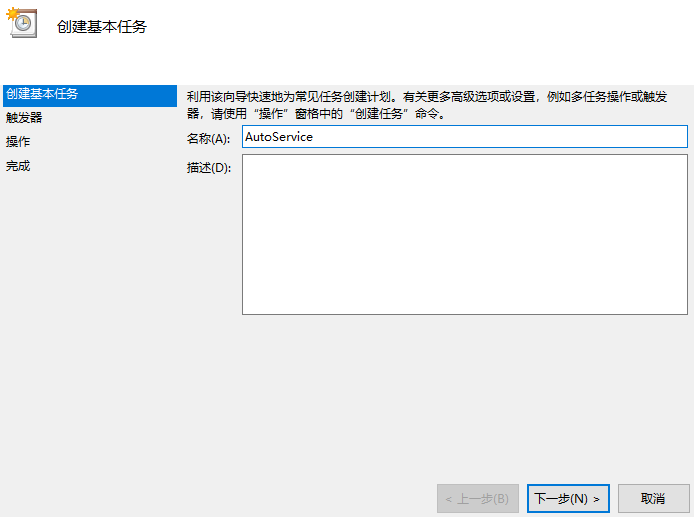
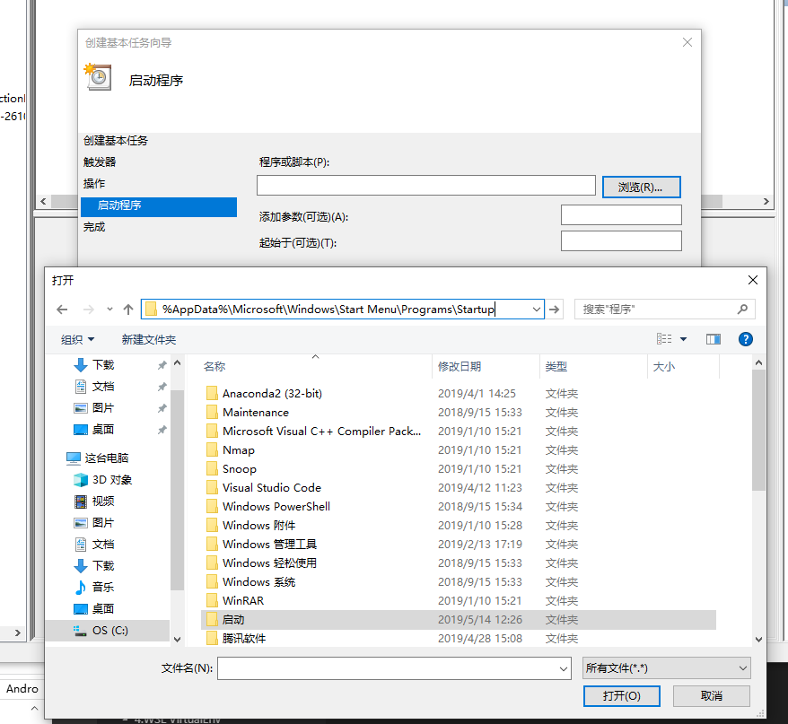
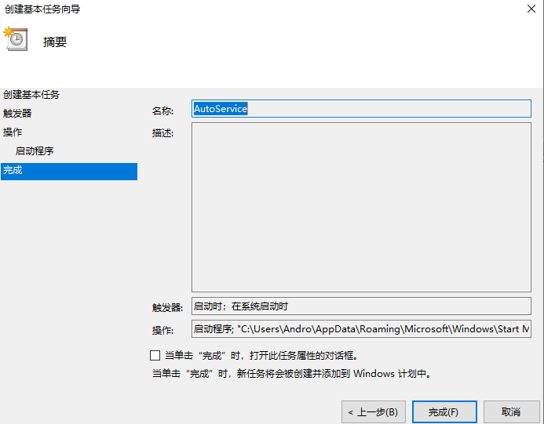

windows10子系统ubuntu使用xshell登陆
1.打开Ubuntu命令行
cd /etc/ssh #切换到ssh配置文件的位置
sudo cp sshd_config sshd_config.bak   #先把原来的备份
sudo vim sshd_config		#编辑配置文件

2.修改sshd_config配置
    Port 3652  #修改端口，原来的22端口已经存在
    ListenAddress 0.0.0.0  #打开本地监听
    #StrictModes yes  #注释掉
    PasswordAuthentication yes  #修改登陆的方式，允许密码登陆

3.启动SSH
sudo service ssh start 

Could not load host key: /etc/ssh/ssh_host_rsa_key
Could not load host key: /etc/ssh/ssh_host_ecdsa_key
Could not load host key: /etc/ssh/ssh_host_ed25519_key

4.重新生成host key 
sudo dpkg-reconfigure openssh-server

5.重新启动SSH
sudo service ssh restart

6.配置SSH自动启动
sudo systemctl enable ssh

7.check ssh auto status
 sudo systemctl is-enabled ssh

https://blog.csdn.net/tengchengbaba/article/details/85481145


#### 运行为windows后台进程
当前WSL并不支持ssh server作为服务运行。
```
set ws=wscript.createobject("wscript.shell")
ws.run "C:\Windows\System32\bash.exe -c 'sudo /usr/sbin/sshd -D'",0
```
1. Win + R 
2. CMD
3. cd %AppData%\Microsoft\Windows\Start Menu\Programs\Startup
4. 将上面的脚本，保存为 startWSL.vbs

> 上述脚本存在一个问题，就是执行sudo时，会提示输入密码，而这时又无法拿到用户的输入。要解决这一问题，需要允许sudo在没有密码的情况下执行命令。我们需要借助windows计划任务和脚本，使得在windows启动时自动运行这一服务。

#### 添加 sudo 无密码权限：
```
#includedir /etc/sudoers.d
$username ALL=(ALL) NOPASSWD: /usr/sbin/sshd -D
```
这里的$username即wsl子系统中的一个用户名。我使用了安装wsl时给出的一个用户名

1. Win + R 
2. CMD
3. cd AppData\Local\Packages\CanonicalGroupLimited.UbuntuonWindows_79rhkp1fndgsc\LocalState\rootfs\etc
4. start .
5. 将上面的脚本,插入至 sudoers


####打开任务计划程序
1. Win + R
2. taskschd.msc
3. 
4. 
5. 
6. 
7. 
8. 


