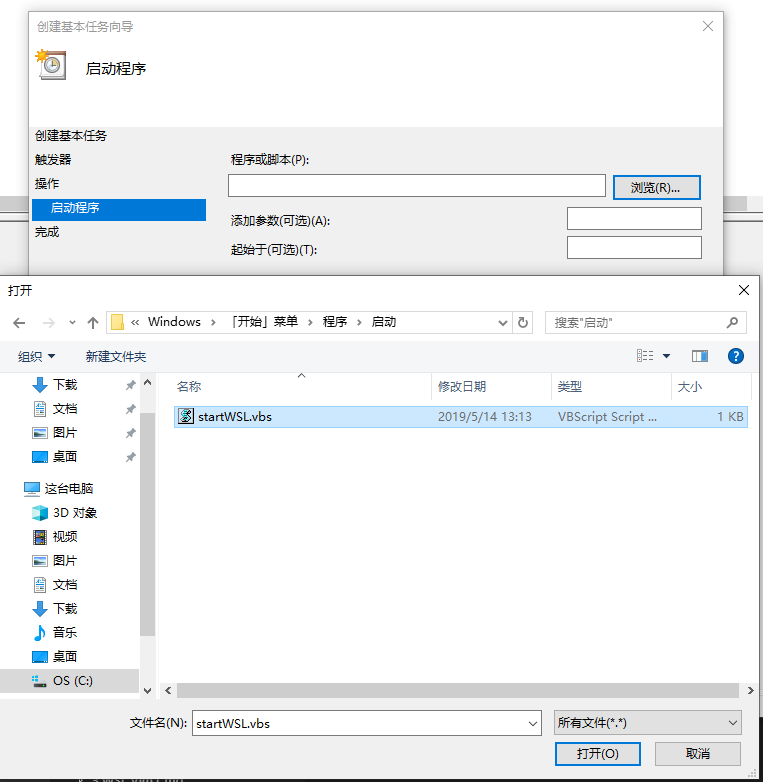

#### Windows10子系统Ubuntu使用xshell登陆


* 切换到ssh配置文件的位置
    cd /etc/ssh 
    ```
    # 先把原来的备份
    sudo cp sshd_config sshd_config.bak   
    # 先把原来的备份
    sudo cp ssh_config ssh_config.bak   
    # 编辑配置文件
    sudo vim sshd_config	
    ```	

* 修改sshd_config配置
    ```
    Port 2232  #修改端口，原来的22端口已经存在
    ListenAddress 0.0.0.0  #打开本地监听
    #StrictModes yes  #注释掉
    PasswordAuthentication yes  #修改登陆的方式，允许密码登陆
    ```

* 启动SSH
    sudo service ssh start

    ```
    会出现找不到host key 
    Could not load host key: /etc/ssh/ssh_host_rsa_key
    Could not load host key: /etc/ssh/ssh_host_ecdsa_key
    Could not load host key: /etc/ssh/ssh_host_ed25519_key
    ```
* 重新生成host key 
    sudo dpkg-reconfigure openssh-server

* 重新启动SSH
    sudo service ssh restart

* 配置SSH自动启动
    sudo systemctl enable ssh

* check ssh auto status
    sudo systemctl is-enabled ssh


* 运行为windows后台进程
    当前WSL并不支持ssh server作为服务运行。
    [文件下载][wslvbs-id]

    ```
    set ws=wscript.createobject("wscript.shell")
    cmd = "C:\Windows\System32\bash.exe -c 'sudo /usr/sbin/service ssh start'"
    ws.run cmd,0
    ```

    1. cd %AppData%\Microsoft\Windows\Start Menu\Programs\Startup
    1. 将上面的脚本，保存为 startWSL.vbs

    > 上述脚本存在一个问题，就是执行sudo时，会提示输入密码，而这时又无法拿到用户的输入。要解决这一问题，需要允许sudo在没有密码的情况下执行命令。
    > 我们需要借助windows计划任务和脚本，使得在windows启动时自动运行这一服务。

* 添加 sudo 无密码权限：
    ```
    #includedir /etc/sudoers.d
    $username ALL=(ALL) NOPASSWD: /usr/sbin/service
    ```
    这里的$username即wsl子系统中的一个用户名。我使用了安装wsl时给出的一个用户名

  
    1. cd C:\Users\%USERNAME%\AppData\Local\Packages\CanonicalGroupLimited.UbuntuonWindows_79rhkp1fndgsc\LocalState\rootfs\etc
    1. start .
    1. 将上面的脚本,插入至 sudoers


* 打开任务计划程序
    1. Win + R
    2. taskschd.msc
    3. 
    4. 
    5. 
    6. 
    7. 
    8. 
    9. [文件下载][taskvbs-id]
    10. 或者选择导入
* 重启Windows

#### 相关连接
[在wsl下安装使用sshd全攻略](https://hbaaron.github.io/blog_2017/%E5%9C%A8wsl%E4%B8%8B%E5%AE%89%E8%A3%85%E4%BD%BF%E7%94%A8sshd%E5%85%A8%E6%94%BB%E7%95%A5)
[使用xshell登陆](https://blog.csdn.net/tengchengbaba/article/details/85481145)


[wslvbs-id]: Assets/startWSL.vbs
[taskvbs-id]: Assets/AutoService.xml