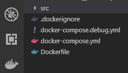
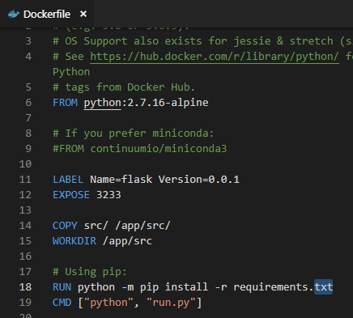

### 制作自己的 Docker 容器(使用 Docker 在 Linux 上托管 flask)

* 编写 Dockerfile 文件  
    怎么写 Dockerfile 文件，实现让用户在 Docker 容器里面运行 Flask 框架。
    作为准备工作，请先下载源码。

- 工具Vs code  
    安装Vs code Extension Docker

- 下载源码  
    $ git clone https://github.com/androllen/HiFlask.git


#### 创建 Dockerfile 
- [Dockerfile 介绍](06.Dockerfile.md)  
从git下载下来的树形图  
    ```
    D:.
    │   .dockerignore
    │   docker-compose.debug.yml
    │   docker-compose.yml
    │   Dockerfile
    │
    └───src
        │   requirements.txt
        │   run.py
        │
        ├───.vscode
        │       settings.json
        │
        └───app
            │   views.py
            │   views.pyc
            │   __init__.py
            │   __init__.pyc
            │
            └───templates
                    base.html
                    index.html
    ```  

- 用vs code 打开HiFlask - 01.flask
- Ctrl + Shift + p 
- 输入 ：docker:Add Docker Files to Workspace
- 插件自动帮你安装  
    
- open dockerfile 写入你自己的环境，切换的工作目录，命令等。
    
  解释：  
    ```
    # 该 image 文件继承官方的 node image，冒号表示标签，这里标签是8.4，即8.4版本的 node。
    FROM python:2.7.16-alpine
    # 
    LABEL Name=flask Version=0.0.1
    # 将容器 3233 端口暴露出来， 允许外部连接这个端口
    EXPOSE 3233    
    # 指示生成image的作者
    MAINTAINER：androllen
    # 将当前目录下src文件夹拷贝到目标目录下app/src文件夹下
    COPY src/ /app/src/
    # 指定接下来的工作路径为/app/src
    WORKDIR /app/src
    # 安装hiflask 项目所需的依赖环境
    RUN pip install --no-cache-dir -r -r requirements.txt
    # 执行命令
    CMD ["python", "run.py"]  
    ```


#### 接下来创建 image

```
# -t参数用来指定 image 文件的名字，后面还可以用冒号指定标签。
# 如果不指定，默认的标签就是latest.最后的那个点表示 Dockerfile 文件所在的路径
$ docker image build -t hiflask .
# 或者 
$ docker image build -t hiflask:0.0.1 .
```

如果运行成功，就可以看到新生成的 image 文件hiflask了  
$ docker image ls  


    

#### 创建 Create a base image
<https://docs.docker.com/develop/develop-images/baseimages/>

#### Dockerfile reference
<https://docs.docker.com/engine/reference/builder/>

#### How to keep your images small
<https://docs.docker.com/develop/dev-best-practices/>
