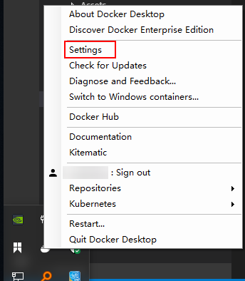
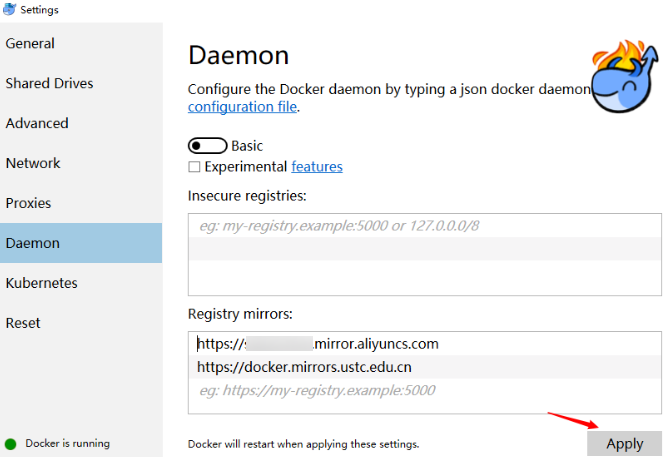

#### 问题
- Cannot connect to the Docker daemon at unix:///var/run/docker.sock. Is the docker daemon running? <https://blog.csdn.net/HOOKTTG/article/details/80626369>
意思是说windows10子系统有其特殊性，需要安装docker for windows，这个就是docker daemon，然后打开如下选项：
然后，执行“docker -H tcp://0.0.0.0:2375 info”就可以返回docker信息了。但是这样很麻烦，所以可执行如下操作


  ```
  echo "export DOCKER_HOST='tcp://0.0.0.0:2375'" >> ~/.bashrc
  source ~/.bashrc
  ```
  然后就可以直接执行“docker info”了。

- Manage Docker as a non-root user
    * sudo groupadd docker
    * sudo usermod -aG docker $USER
    * docker run hello-world

- 当年创建image 使用了这个命令出现了问题
  ```
  $ docker image build -t hiflask:0.0.1 .
  Sending build context to Docker daemon  168.4kB
  Step 1/5 : FROM node:8.4
  Get https://registry-1.docker.io/v2/: net/http: request canceled while waiting f                  or connection (Client.Timeout exceeded while awaiting headers)
  ```

  可以去这里申请：  
  [容器Hub服务](https://cr.console.aliyun.com/cn-hangzhou/instances/mirrors)


  您可以参考以下配置步骤：
  在系统右下角托盘图标内右键菜单选择 Settings，打开配置窗口后左侧导航菜单选择 Docker Daemon。编辑窗口内的JSON串，填写下方加速器地址：  
  

  ```
  {
    "registry-mirrors": ["https://xxxx.mirror.aliyuncs.com"]
  }
  ```

    
  编辑完成后点击 Apply 保存按钮，等待Docker重启并应用配置的镜像加速器。

  如果是开虚拟机搭建的Linux这样操作
  ```
  sudo systemctl daemon-reload
  sudo systemctl restart docker
  ```