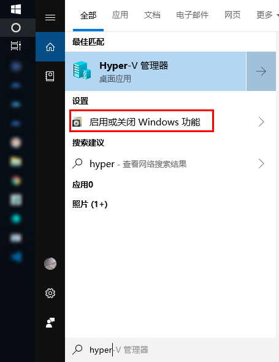
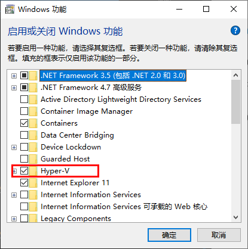
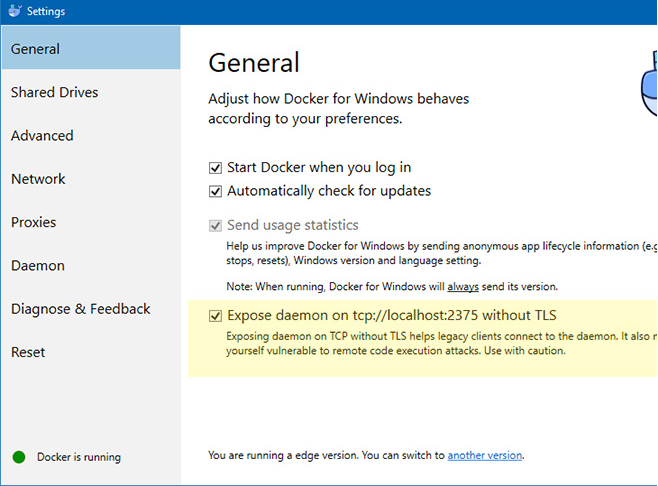
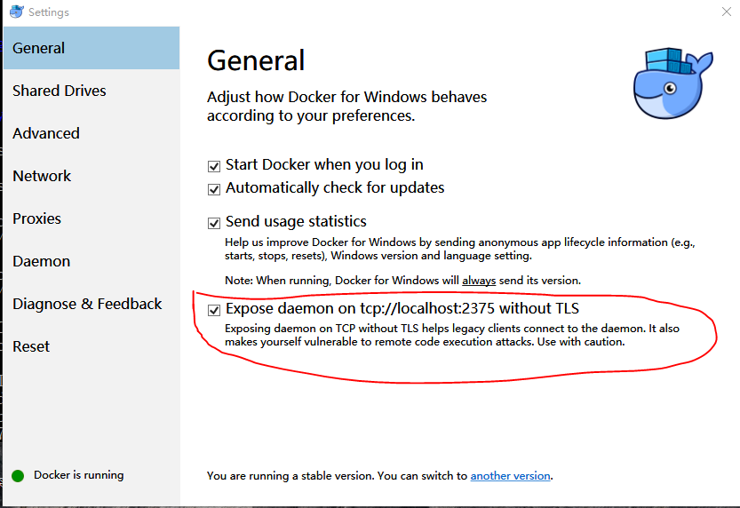

<p align="center">

</p>
<h1 align="center">Docker入门教程</h1>

## 目录

### Docker配置
* 
* 
* 重启电脑

### Docker for Windows Installer 
[下载地址](https://download.docker.com/win/stable/Docker%20for%20Windows%20Installer.exe)
客户端和docker通信，必须打开以下黄色背景的选项


### 在WSL上安装 Docker
* 在线下载
1. sudo apt-get update
2. sudo apt-get install \
    apt-transport-https \
    ca-certificates \
    curl \
    gnupg-agent \
    software-properties-common
3. curl -fsSL https://download.docker.com/linux/ubuntu/gpg | sudo apt-key add -
4. sudo apt-key fingerprint 0EBFCD88
5. sudo add-apt-repository \
   "deb [arch=amd64] https://download.docker.com/linux/ubuntu \
   $(lsb_release -cs) \
   stable"
6. sudo apt-get update
7. sudo apt-get install docker-ce docker-ce-cli containerd.io
8. docker version   
 
* [离线下载地址](https://download.docker.com/linux/ubuntu/dists/bionic/pool/stable/amd64/)
    >把下载的文件放到用户名目录下

    ```
    # 客户端
    sudo dpkg -i containerd.io_1.2.5-1_amd64.deb
    sudo dpkg -i docker-ce_18.09.6_3-0_ubuntu-bionic_amd64.deb
    sudo dpkg -i docker-ce-cli_18.09.6_3-0_ubuntu-bionic_amd64.deb
    ```

### Docker 更换源

### Docker 服务命令
* 开启  
sudo service docker start
* 查看状态  
sudo service docker status
* 开机自启动  
sudo systemctl enable docker
* 查看开机自启动状态  
sudo systemctl is-enabled docker
* 禁用开机自启  
sudo systemctl disable docker
* 卸载docker


### [Docker 三大组件](https://docs.microsoft.com/zh-cn/dotnet/standard/containerized-lifecycle-architecture/docker-containers-images-and-registries)
>使用 Docker 时，可以创建应用和服务并将它们及其依赖项打包到容器映像中。 
映像是应用或服务及其配置和依赖项的静态表示形式。
若要运行应用或服务，应用的映像会被实例化，从而创建一个在 Docker 主机上运行的容器。 
容器最初在开发环境或 PC 中进行测试。
在注册表中，作为映像库中存储图像。 需要注册表才可部署到生产协调程序。 
Docker 通过 Docker Hub维护一个公共注册表；
其他供应商为不同映像集合提供注册表，包括 Azure 容器注册表。 
或者，企业可以在本地为自己的 Docker 映像建立一个专用注册表。

#### Image映像
> 包含创建容器所需的所有依赖项和信息的包。 映像包括所有依赖项（例如框架），以及容器运行时使用的部署和执行配置。 通常情况下，映像派生自多个基础映像，这些基础映像是堆叠在一起形成容器文件系统的层。 创建后，映像不可变。
* 列出本机的所有 image 文件。  
$ docker image ls

* 删除 image 文件  
$ docker image rm [imageName]

#### Container容器
> Docker 映像的实例。 容器表示单个应用程序、进程或服务的执行。 它由 Docker 映像的内容、执行环境和一组标准指令组成。 在缩放服务时，可以从相同的映像创建多个容器实例。 或者，批处理作业可以从同一个映像创建多个容器，向每个实例传递不同的参数。从应用程序的角度来看，实例化映像（创建容器）类似于实例化 服务或 Web 应用等进程。
* 列出本机正在运行的容器  
$ docker container ls

* 列出本机所有容器，包括终止运行的容器  
$ docker container ls --all

#### Registry
> 提供存储库访问权限的服务。 大多数公共映像的默认注册表是 Docker 中心（归作为组织的 Docker 所有）。 注册表通常包含来自多个团队的存储库。 公司通常使用私有注册表来存储和管理其创建的映像。

#### 存储库 (repo)
> 相关的 Docker 映像集合，带有指示映像版本的标记。 某些存储库包含特定映像的多个变量，例如包含 SDK（较重）的映像，包含唯一运行时（较轻）的映像，等等。这些变量可以使用标记进行标记。 单个存储库中可包含平台变量，如 Linux 映像和 Windows 映像。

#### Dockerfile
包含有关如何生成 Docker 映像的说明的文本文件。 就像批处理脚本、 第一行说明从开始，然后按照说明安装所需的程序，复制文件的基本映像，而你需要依此类推，直到获取工作环境。


### 问题
* Cannot connect to the Docker daemon at unix:///var/run/docker.sock. Is the docker daemon running? <https://blog.csdn.net/HOOKTTG/article/details/80626369>
意思是说windows10子系统有其特殊性，需要安装docker for windows，这个就是docker daemon，然后打开如下选项：
然后，执行“docker -H tcp://0.0.0.0:2375 info”就可以返回docker信息了。但是这样很麻烦，所以可执行如下操作


```
echo "export DOCKER_HOST='tcp://0.0.0.0:2375'" >> ~/.bashrc
source ~/.bashrc
```
然后就可以直接执行“docker info”了。

* Manage Docker as a non-root user
    * sudo groupadd docker
    * sudo usermod -aG docker $USER
    * docker run hello-world

#### 相关链接
http://www.ruanyifeng.com/blog/2018/02/docker-tutorial.html
https://zhuanlan.zhihu.com/p/58436705
https://download.docker.com/linux/ubuntu/dists/
https://www.cnblogs.com/kaixinyufeng/p/9389348.html


docker之安装和基本使用(一)
https://www.cnblogs.com/cwp-bg/p/9365983.html
https://www.cnblogs.com/cwp-bg/p/9376130.html

https://blog.csdn.net/li_yan_sring/article/details/84408701
https://www.cnblogs.com/cwp-bg/p/9376130.html
https://blog.csdn.net/wxb880114/article/details/82904765
https://blog.csdn.net/qq_28295425/article/details/86537124


https://docs.microsoft.com/zh-cn/dotnet/standard/containerized-lifecycle-architecture/what-is-docker

https://docs.docker.com/install/linux/linux-postinstall/#manage-docker-as-a-non-root-user
使用 Docker 在 Linux 上托管 flask
Linux开启启动Docker
sudo chkconfig docker on 