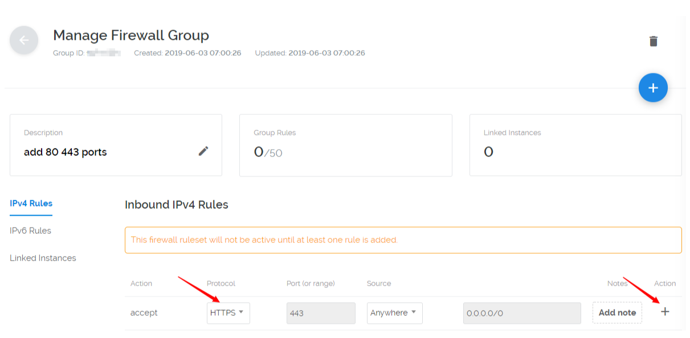
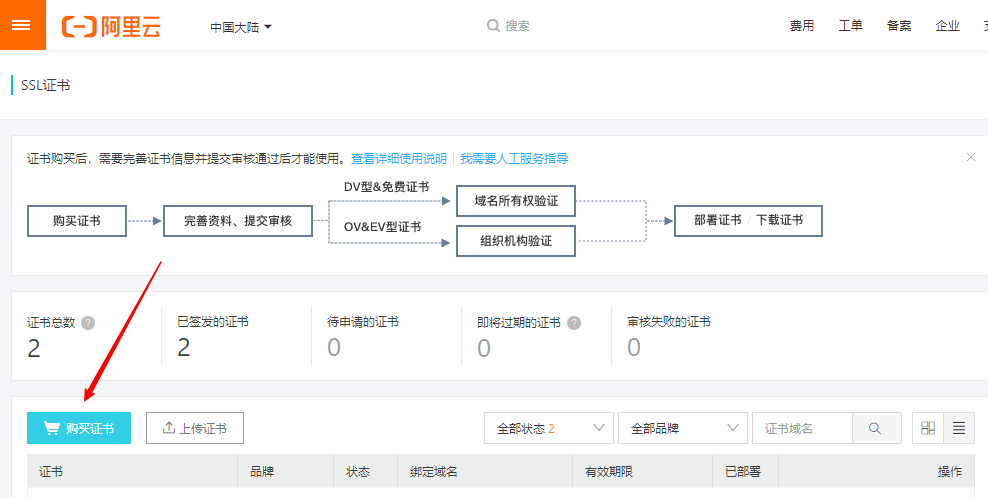

<p align="center">

<h2 align="center">ufw cert</h2>
</p>

#### Ubuntu fire wall(ufw)

- 打开 vultr 在控制台选择->firewall->add friewall group,添加一套防火墙规则  
    

-  给这个防火墙规则命名  
    
    

- 添加 80、443 端口，protocol 选择 http，点击加号，添加 80 端口；protocol 选择 https，点击加号，添加 443 端口  
    
    

- 将这套防火墙规则应用到 vps 主机，选择 linked instances,选择你要开启端口的 vps，然后点击加号即可 
     

- 在 vps 主机中配置 ubuntu 主机开放 80、443 端口
  ``` bash
  sudo ufw allow 80
  sudo ufw allow 443
  sudo ufw status
  sudo ufw reload
  
  sudo ufw disable
  sudo ufw enable
  ```


#### Cert 证书

- 免费申请证书地址
  [腾讯证书](https://cloud.tencent.com/)
  [阿里证书](https://homenew.console.aliyun.com/)

- 阿里云申请证书流程
  - 
  - 
  - 
  - 自己处理吧需要等等15分钟左右证书就制作好了。
  - 制作好之后和Nginx进行配合，[请查看](06.Nginx_Https.md)
    

#### ufw 命令
  ``` bash
  # 外来访问默认允许/拒绝
  ufw default allow/deny
  # 允许/拒绝 访问20端口,20后可跟/tcp或/udp，表示tcp或udp封包。
  ufw allow/deny 20
  # ufw从/etc/services中找到对应service的端口，进行过滤。
  ufw allow/deny servicename
  # 允许自10.0.1.0/10的tcp封包访问本机的25端口。
  ufw allow proto tcp from 10.0.1.0/10 to 本机ip port 25
  # 删除以前定义的"允许/拒绝访问20端口"的规则
  ufw delete allow/deny 20
  ```

  
[如何配置](https://www.vultr.com/docs/how-to-configure-ufw-firewall-on-ubuntu-14-04)  
[防火墙说明](https://www.cnblogs.com/OnlyDreams/p/7210914.html)
     