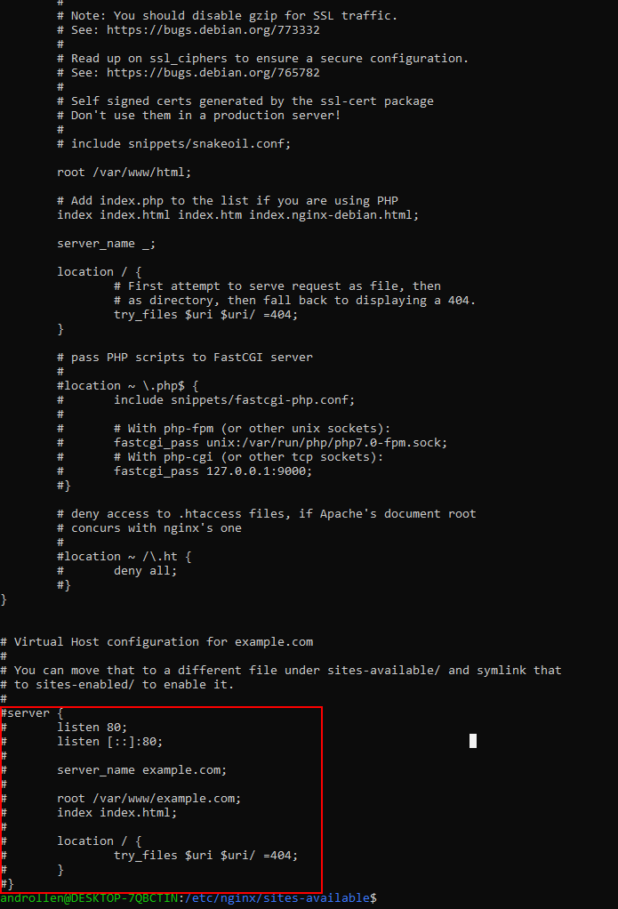

<p align="center">

<h2 align="center">Nginx HTTP</h2>
</p>

### 基于HTTP服务的反向代理

  要将Nginx配置为```HTTP服务器的反向代理```，请打开域的虚拟主机配置文件，并在其中指定位置和代理服务器：
  在基于Ubuntu和Debian的发行版上，服务器块文件存储在/etc/nginx/sites-available目录中，而在CentOS /etc/nginx/conf.d目录中。
  cd /etc/nginx/sites-available
  sudo vim default
  

  ``` nginx
  server {

      listen 80;
      server_name www.example.com example.com;

      # 所有/app请求传递到代理服务器的位置http://127.0.0.1:808
      location /app {
        # 可以使用HTTP或HTTPS作为协议，域名或IP地址，以及可选的端口和URI作为地址
        proxy_pass http://127.0.0.1:8080;
      }
  }
  ```

  [Nginx location](https://www.cnblogs.com/coder-yoyo/p/6346595.html)
