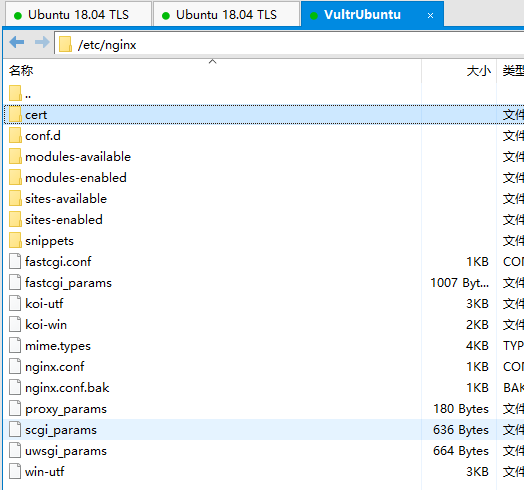
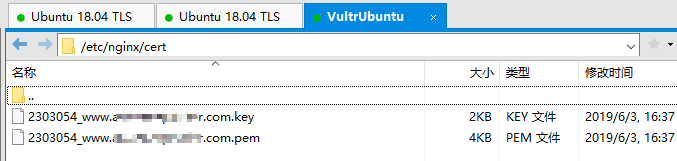
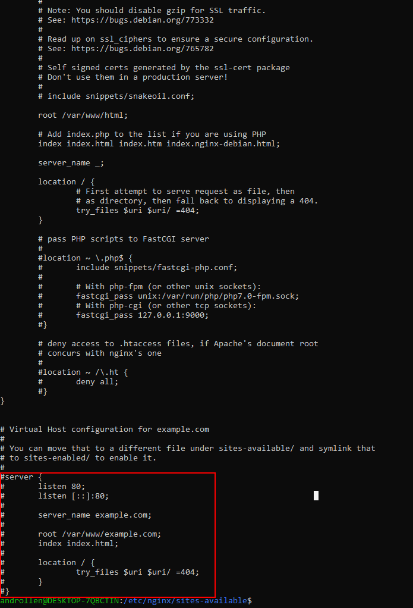
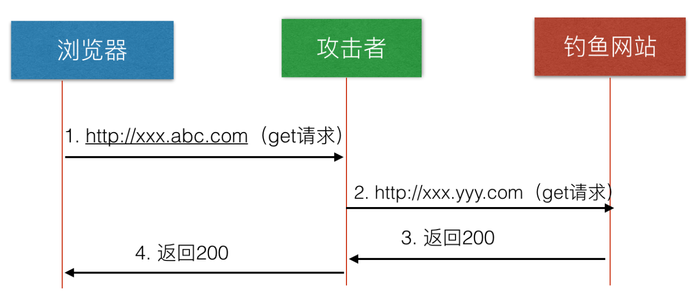
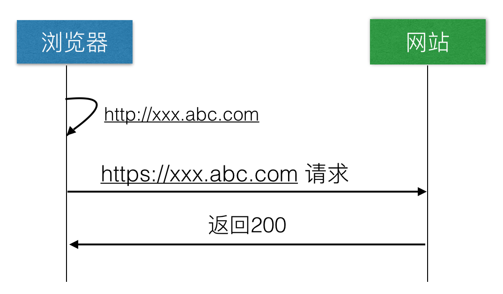

<p align="center">

<h2 align="center">Nginx HTTPS</h2>
</p>

### 配置HTTPS 协议到 Nginx

- 检查防火墙
  确定开启 80 端口和 443 端口

  ``` bash
  ufw status
  Status: active

  To                         Action      From
  --                         ------      ----
  22/tcp                     ALLOW       Anywhere
  80                         ALLOW       Anywhere
  443                        ALLOW       Anywhere
  22/tcp (v6)                ALLOW       Anywhere (v6)
  80 (v6)                    ALLOW       Anywhere (v6)
  443 (v6)                   ALLOW       Anywhere (v6)
  ```

  没有开启请跳转至[Ubuntu fire wall](04.Ufw_Cert.md)开启

- 准备证书
  请确定从官方网站下载[阿里免费ssl证书](04.Ufw_Cert.md)

- 配置 应用于 Gunicorn uwsgi  FastCGI 等
  
  在 /etc/nginx 目录下
  
  
  mkdir cert  
  通过 `winscp` 上传至此目录  
  修改 `default`  
  cd /etc/nginx/sites-available  
  sudo vim default  
  

  ``` bash
  server {
    listen 443 ssl;
    server_name www.achinesepainter.com;

    keepalive_timeout   70;
    add_header Strict-Transport-Security "max-age=31536000; includeSubDomains; preload" always;

    ssl_certificate      cert/2303054_www.achinesepainter.com.pem;
    ssl_certificate_key  cert/2303054_www.achinesepainter.com.key;

    # 储存SSL会话的缓存type和大小
    ssl_session_cache    shared:SSL:1m;
    ssl_session_timeout 5m;
    ssl_protocols TLSv1 TLSv1.1 TLSv1.2;
    # 为建立安全连接，服务器所允许的密码格式列表
    ssl_ciphers ECDHE-RSA-AES128-GCM-SHA256:ECDHE:ECDH:AES:HIGH:!NULL:!aNULL:!MD5:!ADH:!RC4;
    # 依赖SSLv3和TLSv1协议的服务器密码将优先于客户端密码
    ssl_prefer_server_ciphers  on;

    location / {
        proxy_pass http://127.0.0.1:5000;

        proxy_set_header Host $host;
        proxy_set_header X-Forwarded-For $proxy_add_x_forwarded_for;
        proxy_set_header X-Real-IP         $remote_addr;
        proxy_set_header X-Forwarded-Host  $host;
        proxy_set_header X-Forwarded-Port  $server_port;

        access_log /var/log/nginx/access.log;
        error_log  /var/log/nginx/error.log;
        # First attempt to serve request as file, then
        # as directory, then fall back to displaying a 404.
        try_files $uri $uri/ =404;
    }
  }

  ```sh
  sudo service nginx reload
  sudo service nginx status
  访问 192.168.101.76 或者 https://127.0.0.1:8000

  解释：
  - Host $host- $host 以下优先顺序中的变量包含：请求行中的主机名，Host请求头字段中的主机名，或与请求匹配的服务器名称。
  - X-Forwarded-For $proxy_add_x_forwarded_for - 包含客户端已通过代理的每个服务器的IP地址的列表。
  - X-Real-IP $remote_addr - 将真实访问者远程IP地址转发到代理服务器。
  - X-Forwarded-Host $host - 定义客户端请求的原始主机。
  - X-Forwarded-Port $server_port - 定义客户端请求的原始端口。

### HSTS

- 传统请求
  
- 流行请求
  

[HTTP Strict Transport Security (HSTS) and NGINX](https://www.nginx.com/blog/http-strict-transport-security-hsts-and-nginx/)
[更安全的HTTPS](https://linuxize.com/post/secure-nginx-with-let-s-encrypt-on-ubuntu-18-04/)
[https](https://blog.liubaicai.net/2019/04/15/ce-shi-huan-jing-pei-zhi-Nginx-zhi-chi-Https/)
[HTST](https://www.cnblogs.com/tugenhua0707/p/10945934.html)
