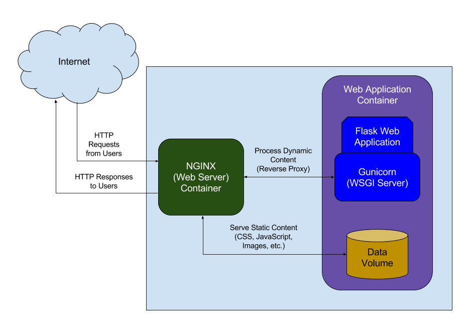
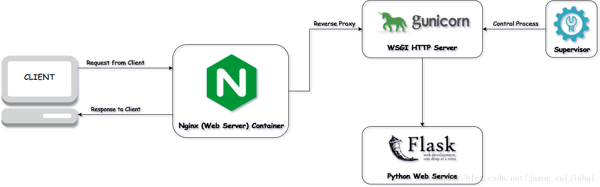

<h2 align="center">Nginx HTTPS</h2>

### Nginx 

- [安装Nginx](01.Install_Nginx.md)
- [命令行](02.Commands.md)
- [反向代理](03.Reverse_Proxy.md)
- [防火墙](04.ufw.md)
- [Nginx_Http](05.Nginx_Http.md)
- [Nginx_Https](06.Nginx_Https.md)
- [Nginx_Config](07.Nginx_Config.md)
- [Nginx_Daemon](08.Nginx_Daemon.md)

### 使用Nginx反向代理配置web应用服务器(Gunicorn)

[Nginx 教程](http://openresty.org/download/agentzh-nginx-tutorials-zhcn.html)

