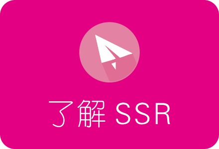

<h2 align="center">个人搭建SSR需要哪些条件？其实很简单！</h2>

### SSR简单介绍 帮助新手快速入门

对很多老鸟来说，SSR已经是很熟悉的上网工具了。但对大部分刚接触的朋友来说，可能对SSR还不太了解，下面我们对SSR功能和用途做个简单介绍。

#### 1. 什么是SSR？
SSR，全称为ShadowSocksR，出于读写方便的目的，被简称为SSR。

#### 2.那ShadowSocksR又是什么？
ShadowSocksR则是原版ShadowSocks（SS）的一个衍生版本，相比原版而言，主要增加了混淆参数功能 。
#### 3.SSR有什么功能？

一般来说，SSR目前主要有以下三种用途。  

首先，与原版一样，SSR可以被用做科学上网（翻*墙）。由于你懂的原因，一些正规网站在国内无法访问，比如Goolge、Youtube、Facebook、Twitter等。这给一些需要查阅科研资料、从事对外贸易、个人休闲娱乐的朋友造成了些许不便。而借助SSR我们可以轻易解决这些问题。  

其次，由于SSR相比原版特有的混淆参数功能，国内一些手机用户用它来做免流。这一点很多朋友可能不了解，大概介绍一下，一些移动运营商存在一些特定的免流优惠，比如手机流量登录运营商客户端免流量。前期是简单的通过网址来判断是否符合免流条件。SSR安装在手机上后，上网时手机流量经SSR转发到上网地址，通过在SSR内加入免流网址的混淆参数后，让运营商判断失误，达到免流的目的。  

最后，可以在国内模拟某些国外地区的IP，从而收看国外一些限制地区的视频资源，或者申请一些限制国家地区的服务。

#### 4.SSR相比原版有什么优势？
针对科学上网功能来说，两者都可以达到目的。不过使用这个功能时，有一定机率被墙封锁服务器端口或IP。目前根据众多网友的反馈，使用SSR可以在一定程度上降低被封锁或限制的机率，所以SSR是目前相对比较主流的科学上网工具。  
另外一点，前面也说过了，SSR独有手机流量免流功能，这一点是原版没有的。但是相比免流大行其道的前两年，最近出于避免收入损失的目的，各运营商明显在加强封堵这个漏洞。SSR免流在一些特定地区或特定套餐下，依然可以使用，但获取免流混淆参数的难度大了很多。再加上流量资费下降和无限量套餐的推广，SSR免流如今没那么流行了。  
#### 5.SSR科学上网的实现原理是什么？
购买国外VPS服务器，在服务器端安装SSR服务端，在本地电脑或手机或路由器上安装SSR客户端。
实现路径：本地SSR客户端——国外服务器SSR服务端——真实上网地址。
简单来说，就是用国外服务器当做桥梁，曲线达到目的。

#### 6.听起来有些复杂，我是新手，可以很方便的搭建SSR吗？
其实并不难。SSR客户端有现成的程序或APP，下载安装就可以了，很简单。而服务器端也有各路大神的一键安装包可用。  
至于VPS服务器的购买，也很方便，部分国外VPS服务器支持支付宝付款，价格也比较便宜。  