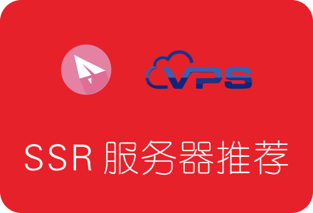

<h2 align="center">适合搭建SSR的国外VPS服务器推荐汇总</h2>

#### 什么是VPS
VPS的全称是 Virtual Private Server，中文解释就是虚拟专用服务器，是相对于独立的服务器来说的。  
一台独立服务器，可以划分为n台VPS，每台VPS都可分配独立公网IP地址、独立操作系统，可以像独立服务器一样，重装操作系统，安装程序，单独重启服务器。  
因为VPS的价格更低，适合个人用户使用，所以我们搭建SSR一般都是在VPS上进行。

> VPS只是一个统称，在各商家的具体叫法可能各不相同。一般来说，与服务器相关的，只要商家没有明确标注是独服，就可以认为是VPS了。
