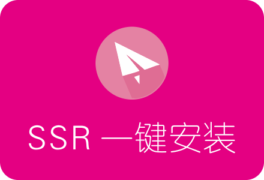
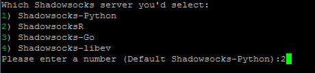
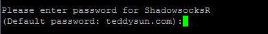
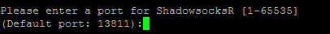
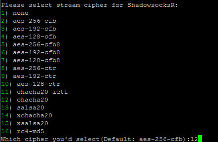
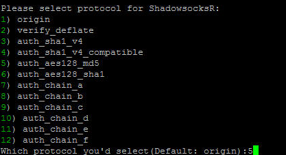
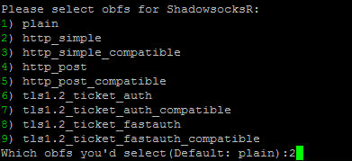
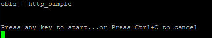
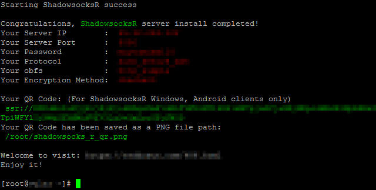

<p align="center">

<h2 align="center">SSR一键安装脚本 (ShadowsocksR一键安装教程)</h2>
</p>


#### SSR一键安装
关于在VPS服务器上安装SSR服务端，网上有众多一键安装脚本供我们选择，所以安装过程比较简单。这里我们以teddysun的一键安装为例，简单介绍下SSR服务器端的安装。

#### 支持平台

本一键安装脚本为服务器端使用，即SSR服务端一键安装。
服务器系统： CentOS 6 及以上、Debian 7 及以上、Ubuntu 12 及以上
系统内存支持128M及以上，推荐256M起步。

#### 安装流程

1.在电脑端打开Putty，连接VPS服务器，以root用户登录。  
2.登录成功后，依次运行以下三条命令：
```
wget --no-check-certificate -O shadowsocks-all.sh https://raw.githubusercontent.com/teddysun/shadowsocks_install/master/shadowsocks-all.sh
chmod +x shadowsocks-all.sh
./shadowsocks-all.sh 2>&1 | tee shadowsocks-all.log
```
> 如果运行上面第一条命令时，出现找不到wget之类的提示，则表明系统没有预装wget，先运行以下命令完成wget的安装
```
CentOS：
yum -y install wget
Ubuntu/Debian：
apt-get -y install wget
```
3.接下来会有几个参数需要选择，依次为：  
- 1.提示选择哪个版本安装，我们输入2后按回车，即选择SSR安装。  

<p align="center">

</p>

- 2.然后会提示设置SSR密码，输入自定义密码后按回车，建议不要使用默认密码。   
<p align="center">
    
</p>

- 3.接下来选择SSR要使用的服务器端口，随便输入一个，也可以默认回车。

<p align="center">
    
</p>

- 4.然后选择加密方式，如果选择chacha20的话，就输入对应序号12，按回车继续。

<p align="center">
    
</p>
 
- 5.接下来选择协议，建议选择自auth_aes128_md5开始以下的几种，输入对应序号按回车。

<p align="center">
    
</p>
   
- 6.然后选择混淆方式，如下图所示，选择好后按回车。

<p align="center">
    
</p>
     
- 7.以上参数选择完成后，按任意键开始安装。

<p align="center">
    
</p>
       
- 8.安装完成后，会有如下图安装成功的提示，记住刚才设置的各项参数，在客户端连接时需要用到。

<p align="center">
    
</p>

- 9.经过以上几个简单的参数选择后，SSR服务器端已经自动安装成功了。保险起见，输入reboot重启VPS服务器，SSR会自动随系统重启。

SSR服务端安装成功后，就可以在电脑、手机、路由器等设备上的SSR客户端上，按照以上设置的各项参数进行连接了。

SSR客户端下载及使用可以参考：[SSR各平台客户端下载汇总](06.DownloadSSR.md)

#### SSR常用命令
Putty连接至VPS服务器，分别运行如下各命令：  
```
启动SSR：
/etc/init.d/shadowsocks-r start
退出SSR：
/etc/init.d/shadowsocks-r stop
重启SSR：
/etc/init.d/shadowsocks-r restart
SSR状态：
/etc/init.d/shadowsocks-r status
卸载SSR：
./shadowsocks-all.sh uninstall
```
另外如果需要更改SSR的相关配置参数，配置文件位置在：/etc/shadowsocks-r/config.json