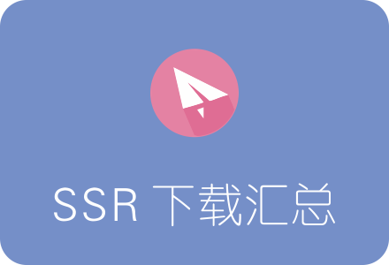

<h2 align="center">SSR各平台客户端下载汇总</h2>

ShadowSocksR分为服务器端和客户端，两者要分别安装，配合使用。 

服务器端一般只需安装一个版本，而客户端则根据平台的不同，分为多个版本。目前SSR客户端的可用平台有：路由器版、Windows版、安卓版、IOS版、MAC版，基本涵盖我们日常使用环境。

#### SSR服务器端
ShadowSocksR服务器端无需下载，只需在VPS服务器上，运行SSR一键安装脚本即可：

[SSR一键安装脚本 (ShadowsocksR一键安装教程)](05.InstallSSR.md)

#### SSR Windows客户端
SSR Windows客户端主要用于电脑端，目前最新版本为 4.9.0

下载地址：

https://github.com/shadowsocksrr/shadowsocksr-csharp/releases/download/4.9.0/ShadowsocksR-win-4.9.0.zip

安装及使用教程：[SSR Windows客户端下载、安装及使用教程](07.ConfigClient.md)

#### SSR 安卓客户端
SSR 安卓客户端主要用于安卓手机、安卓平板平台，目前最新版本为3.5.4  
下载地址：https://github.com/shadowsocksrr/shadowsocksr-android/releases/download/3.5.4/shadowsocksr-android-3.5.4.apk
#### SSR 苹果iOS客户端
ShadowSocksR
#### SSR MAC客户端
SSR MAC客户端主要用于苹果电脑设置，如iMAC、Macbook。  
下载地址：https://github.com/qinyuhang/ShadowsocksX-NG-R/releases/download/1.4.3-R8-build3/ShadowsocksX-NG-R8.dmg  
安装及使用教程：[SSR MAC客户端ShadowsocksX-NG-R下载、安装及使用教程]()
#### SSR 路由器客户端