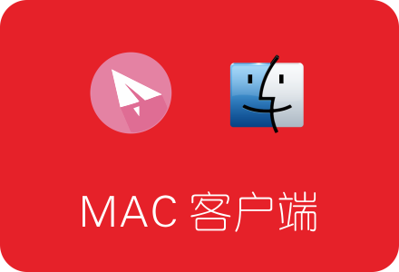
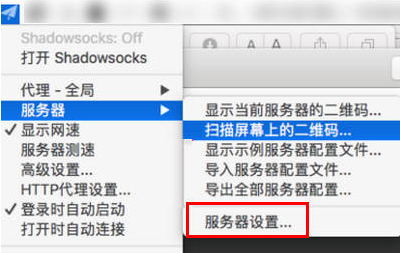
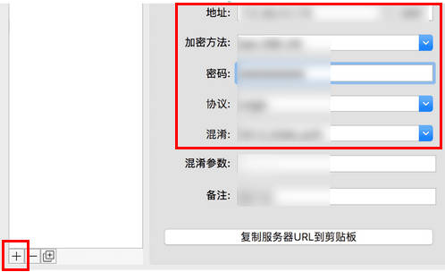
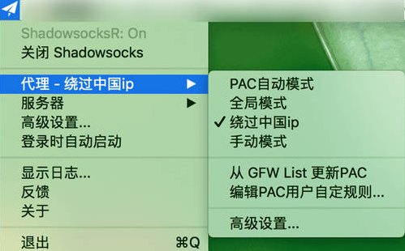

<h2 align="center">SSR MAC客户端ShadowsocksX-NG-R下载、安装及使用教程</h2>

#### MAC Shadowsocks客户端各版本区别
Shadowsocks 的MAC客户端，主要有两个版本：ShadowsocksX 和 ShadowsocksX-NG，其中ShadowsocksX-NG为ShadowsocksX的最新版本 。目前这两个版本仅支持SS原版，不支持SSR的混淆功能。    
而ShadowsocksR的MAC客户端，则衍生于以上两个版本，在名称后面多个字母R：ShadowsocksX-R 和 Shadowsocks-NG-R。带R版本支持SSR混淆功能。

目前更建议安装 Shadowsocks-NG-R 版本，下面我们会做详细介绍。  

小提示：使用SSR客户端前，需要先在国外VPS服务器上搭建SSR服务端。

[SSR服务端一键安装教程：](05.InstallSSR.md)  

#### ShadowsocksX-NG-R 下载
ShadowsocksX-NG-R 目前最新版本为 ShadowsocksX-NG-R8 1.4.4，适用于iMac/Macbook。  
下载地址：[https://github.com/qinyuhang/ShadowsocksX-NG-R/releases/download/1.4.4-r8/ShadowsocksX-NG-R8.dmg](https://github.com/qinyuhang/ShadowsocksX-NG-R/releases/download/1.4.4-r8/ShadowsocksX-NG-R8.dmg)
#### ShadowsocksX-NG-R 安装和使用
1.下载完成后，打开dmg文件，然后将其拖动到右侧的Applications 安装。  
2.安装完成后，从LaunchPad或应用程序中打开，系统右上角会出现小飞机标志。  
3.点击小飞机打开菜单——服务器——服务器设置：  

    

4.在接下来的窗口中，点击左下侧的  + 号，然后在右侧设置服务器参数，下图红框内容为必填项。  
地址：即SSR服务器的IP地址，填好IP地址后，在后面的小框内填入SSR服务端口。  
加密方法：与SSR服务端设置的Stream Cipher参数保持一致。  
密码：填入SSR服务端设置的密码。  
协议：与服务端设置的Protocol参数保持一致。   
混淆：与服务端设置的obfs参数保持一致。  
混淆参数：可以填入一个常用的国外网址，比如cloudflare.com，或者也可以不填。  

    

5.服务器添加成功后，选择代理方式为绕过中国IP。或者也可以选择PAC自动模式，前提是先点击GFW List更新PAC，更新成功后，设置为PAC自动模式。  
 

    

以上各项设置无误后，MAC SSR客户端就配置成功了，开始享受科学上网乐趣吧。