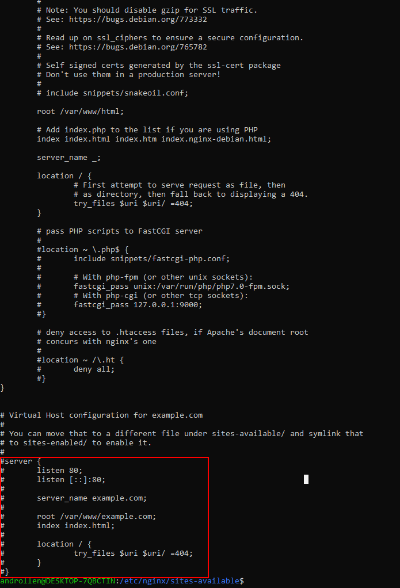

<p align="center">

<h2 align="center">配置反向代理，负载均衡实战解析</h2>
</p>

#### 前言
  A reverse proxy is a service that takes a client request, sends the request to one or more proxied servers, fetches the response, and delivers the server’s response to the client.

  Nginx 负载均衡 提供哪些优点：  
  - Load Balancing  
  - Caching  
  - SSL Termination  
  - Compression  

#### Nginx反向代理
- 基于HTTP服务的反向代理
- 基于非HTTP服务的反向代理

#### 基于HTTP服务的反向代理
  要将Nginx配置为```HTTP服务器的反向代理```，请打开域的虚拟主机配置文件，并在其中指定位置和代理服务器：
  ``` nginx
  server {
      listen 80;
      server_name www.example.com example.com;

      location /app {
        proxy_pass http://127.0.0.1:8080;
      }
  }
  ```
  代理服务器URL使用proxy_pass指令指定，可以使用HTTP或HTTPS作为协议，域名或IP地址，以及可选的端口和URI作为地址。  
  上面的配置告诉Nginx将所有请求传递/app到代理服务器的位置http://127.0.0.1:8080。  
  > 在基于Ubuntu和Debian的发行版上，服务器块文件存储在/etc/nginx/sites-available目录中，而在CentOS /etc/nginx/conf.d目录中。

  为了更好地说明指令location和proxy_pass指令的工作原理，我们采用以下示例：  
  ``` nginx
  server {
    listen 80;
    server_name www.example.com example.com;

    location /blog {
       proxy_pass http://node1.com:8000/wordpress/;
    }
  }
  ```
  如果访问者访问 ```http://example.com/blog/my-post```, Nginx将代理此请求 ```http://node1.com:8000/wordpress/my-post```。  
  当代理服务器的地址包含URI时，/wordpress/传递给代理服务器的请求URI将被指令中指定的URI替换。如果在没有URI的情况下指定代理服务器的地址，则将完整请求URI传递给代理服务器

#### 基于非HTTP服务的反向代理
  应用于 Gunicorn uwsgi  FastCGI 等

  cd /etc/nginx/sites-available  
  sudo vi default  
    
  修改配置
  ``` nginx
  server {
        # 你的服务器的端口
        listen 80;
        
        # 例如 192.168.101.76 你的服务器地址; 可以是域名，也可以写 ip 地址 
        server_name 192.168.101.76;

        location / {
                # 这个是Gunicorn与Ningx通信的端口。和Gunicorn的配置相同
                proxy_pass http://127.0.0.1:8000; 

                proxy_set_header Host $host;
                proxy_set_header X-Forwarded-For $proxy_add_x_forwarded_for;
                proxy_set_header X-Real-IP         $remote_addr;
                proxy_set_header X-Forwarded-Host  $host;
                proxy_set_header X-Forwarded-Port  $server_port;  

                access_log /var/log/nginx/access.log;
                error_log  /var/log/nginx/error.log;
                
                try_files $uri $uri/ =404;
        }
  }
  ```
  sudo service nginx restart  
  sudo service nginx status  
  访问 192.168.101.76 或者 http://127.0.0.1:8000  
  这里将Nginx设置为代理模式,代理到本地的8000端口,之后就可以通过公网访问flask应用了


  解释：  
  - Host $host- $host 以下优先顺序中的变量包含：请求行中的主机名，Host请求头字段中的主机名，或与请求匹配的服务器名称。
  - X-Forwarded-For $proxy_add_x_forwarded_for - 包含客户端已通过代理的每个服务器的IP地址的列表。
  - X-Real-IP $remote_addr - 将真实访问者远程IP地址转发到代理服务器。
  - X-Forwarded-Host $host - 定义客户端请求的原始主机。
  - X-Forwarded-Port $server_port - 定义客户端请求的原始端口。
  
  说明：  
  - nginx收到客户端发来的请求,根据nginx中配置的路由,将其转发给 gunicorn 
  - nginx to gunicorn : gunicorn ,找你的来了
  - gunicorn 服务器根据WSGI协议解析请求，配置好环境变量,调用start_response方法呼叫flask框架 
  - gunicorn 服务器 to flask ：flask,快来接客,客户资料我都给你准备好了
  - flask根据env环境变量，请求参数和路径找到对应处理函数,生成html
  - flask to gunicorn : hi gunicorn ,html文档弄好了,拿去吧
  - gunicorn 拿到html,再组装根据env变量组装成一个http响应,发送给nginx
  - gunicorn 服务器 to nginx ：nginx,刚才谁找我来着?回他个话 OK ??!!
  - nginx再将响应发送给客户端

  [部署](http://docs.gunicorn.org/en/stable/deploy.html)


#### 映射静态网页

#### 支持SSL
  [更安全的HTTPS](https://linuxize.com/post/secure-nginx-with-let-s-encrypt-on-ubuntu-18-04/)  
  [https](https://blog.liubaicai.net/2019/04/15/ce-shi-huan-jing-pei-zhi-Nginx-zhi-chi-Https/)

#### 链接
[Nginx Docker](http://www.ruanyifeng.com/blog/2018/02/nginx-docker.html )  
[Nginx Reverse Proxy](https://linuxize.com/post/nginx-reverse-proxy/)  
[web-server/reverse-proxy](https://docs.nginx.com/nginx/admin-guide/web-server/reverse-proxy/)  
[nginx-reverse-proxy](https://linuxize.com/post/nginx-reverse-proxy/)  
https://www.cnblogs.com/chenhaoyu/p/10815122.html  
