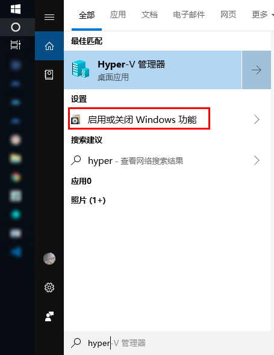
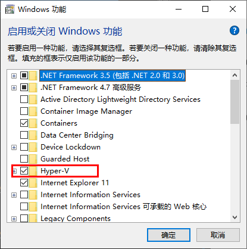

将应用程序与其依赖，打包在一个文件里面。运行这个文件，就会生成一个虚拟容器。程序在这个虚拟容器里运行，就好像在真实的物理机上运行一样

总体来说，用户可以方便地创建和使用容器，把自己的应用放入容器。  
容器还可以进行版本管理、复制、分享、修改，就像管理普通的代码一样。

## Docker 的用途

- 提供一次性的环境。比如，本地测试他人的软件、持续集成的时候提供单元测试和构建的环境。

- 提供弹性的云服务。因为 Docker 容器可以随开随关，很适合动态扩容和缩容。

- 组建微服务架构。通过多个容器，一台机器可以跑多个服务，因此在本机就可以模拟出微服务架构。

### 配置和下载

- Docker配置  
    
    

- 重启电脑

- 桌面客户端
  平台|x86_64
  -----|-----
  [Docker Desktop for Mac (macOS)](https://docs.docker.com/docker-for-mac/install/)|支持
  [Docker Desktop for Windows (Microsoft Windows 10)](https://docs.docker.com/docker-for-windows/install/)|支持

  打开 `docker` 客户端设置，勾选

  ```sh
  # 基于 WSL 服务端的守护进程
  Expose daemon on tcp://localhost:2375 without TLS
  sudo chown -R $USER:$USER .
  ```
