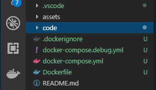
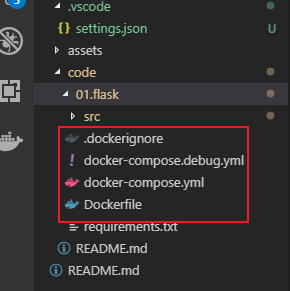
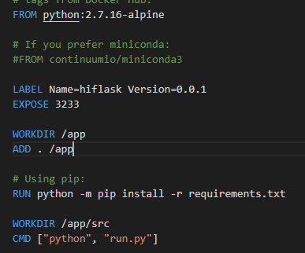

- 编写 Dockerfile 文件  
  怎么写 Dockerfile 文件，实现让用户在 Docker 容器里面运行 Flask/Django 框架。
  作为准备工作，请先准备源码。

- 工具Vs code  
  安装 `Vs code Extension Docker`

- 下载源码  
  `$ git clone https://github.com/androllen/djangoShare.git`

## 创建 Dockerfile

- [Dockerfile 介绍](06.Dockerfile.md)  
从git下载下来的树形图  

  ```sh
  D:.
  │   README.md
  │
  └───01.flask
      │   .dockerignore
      │   docker-compose.debug.yml
      │   docker-compose.yml
      │   Dockerfile
      │   requirements.txt
      │
      └───src
          │   run.py
          │
          ├───.vscode
          │       settings.json
          │
          └───app
              │   views.py
              │   views.pyc
              │   __init__.py
              │   __init__.pyc
              │
              └───templates
                      base.html
                      index.html

  ```  

- 用vs code 打开HiFlask
- Ctrl + Shift + p
- 输入 ：docker:Add Docker Files to Workspace
- 插件自动帮你安装  
  
  
- 把四个生成的文件放到01.flask 文件夹下  
  
    
- open dockerfile 写入你自己的环境，切换的工作目录，命令等。

-   
  
  解释：  

  ```sh
  # 该 image 文件继承官方的 node image，冒号表示标签，这里标签是8.4，即8.4版本的 node。
  FROM python:2.7.16-alpine
  # 生成image的作者
  LABEL Name=flask Version=0.0.1
  # 将容器 3233 端口暴露出来， 允许外部连接这个端口
  EXPOSE 3233
  # 指定接下来的工作路径为/app
  WORKDIR /app
  # 将当前目录下所有文件拷贝到目标目录下/app
  ADD . /app
  # 安装hiflask 项目所需的依赖环境
  RUN python -m pip install -r requirements.txt
  # 切换到工作目录
  WORKDIR /app/src
  # 执行命令
  CMD ["python", "run.py"]  
  ```

### 接下来创建 image

```sh
# -t参数用来指定 image 文件的名字，后面还可以用冒号指定标签。
# 如果不指定，默认的标签就是latest.最后的那个点表示 Dockerfile 文件所在的路径
$ docker image build -t hiflask .
# 或者
$ docker image build -t hiflask:0.0.1 .
```

如果运行成功，就可以看到新生成的 image 文件hiflask了  
$ docker image ls  

<https://blog.csdn.net/y472360651/article/details/81289108>

#### 创建 Create a base image

<https://docs.docker.com/develop/develop-images/baseimages/>

#### Dockerfile reference

<https://docs.docker.com/engine/reference/builder/>
<https://hub.docker.com/_/python>

#### How to keep your images small

<https://docs.docker.com/develop/dev-best-practices/>  
<https://www.jianshu.com/p/d15c4e5239da>
