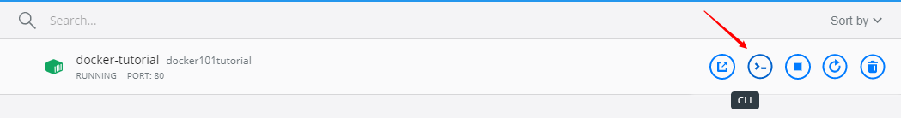
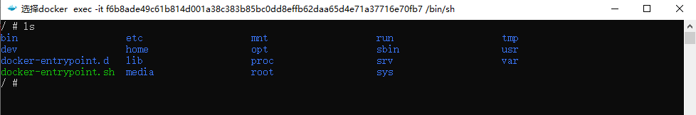

### Install Docker Engine

- DESKTOP
  | 平台                                                                                                     | x86_64 |
  | -------------------------------------------------------------------------------------------------------- | ------ |
  | [Docker Desktop for Mac (macOS)](https://docs.docker.com/docker-for-mac/install/)                        | 支持   |
  | [Docker Desktop for Windows (Microsoft Windows 10)](https://docs.docker.com/docker-for-windows/install/) | 支持   |

- SERVER

  ```sh
  sudo apt update
  sudo apt install docker.io
  ```

### [Install Docker Compose](https://docs.docker.com/compose/install/)

  ```sh
  sudo apt install docker-compose
  ```

### [Compose and Django](https://docs.docker.com/compose/django/)

### 进入容器查看文件系统

- 运行成功的容器
  
    
  

### [Docker Official Sample](https://docs.docker.com/samples/)

  ```sh
  mkdir tesdocker & cd tesdocker
  git clone https://github.com/docker/getting-started.git
  cd getting-started
  docker build -t docker101tutorial .
  docker run -d -p 80:80 --name docker-tutorial docker101tutorial
  docker tag docker101tutorial androllen/docker101tutorial
  docker push androllen/docker101tutorial
  ```

### 迁移代码

sudo rsync -av dogs@192.168.0.50:/home/lord/code /home/lord

### 保存 image

  ```sh
  # 去 源服务器 找到 docker 镜像
  docker images
  docker save -o spring /home/lord/docker/spring.tar
  # or
  docker save myimage:latest | gzip > myimage_latest.tar.gz
  ```

  ```sh
  #!/bin/bash

  RESLIST=("nginx:latest" "postgres:latest")
  echo ${RESLIST[@]}
  SAVE_DIR=`pwd`/bak
  mkdir $SAVE_DIR
  echo "$SAVE_DIR"
  for skill in ${RESLIST[@]}; do
      echo "=======${skill}"
      docker save $skill | gzip > $SAVE_DIR/$skill.tar.gz
  done
  chown "$USER":"$USER" -R $SAVE_DIR
  echo "save over"
  ```

  ```sh
  #!/bin/bash

  RESLIST=("redis:5.0.3" "mongo:latest" "mysql:5.7")
  SAVE_DIR=`pwd`/bak
  for name in ${RESLIST[@]}; do
  echo $name
  docker save $name -o $SAVE_DIR/$name.tar
  done
  chown "dogs":"dogs" -R $SAVE_DIR
  ```

  ```sh
  # 把上面的内容 保存 save.sh
  sudo vim load.sh
  # 在 Ubuntu 任意目录下执行脚本
  sudo bash save.sh
  ```  

### 加载 image

  ```sh
  # 加载保存的文件到 image
  docker load -i spring.tar
  # 后台模式启动一个容器
  docker run -d spring:latest
  ```

  ```sh
  #!/bin/bash

  list=`ls -l | awk '{print $9}'`
  for name in ${list[@]}; do
  echo $name
  docker load -i $name
  done
  echo "load over"
  ```

  ```sh
  # 去目标服务器 加载 docker 镜像，使用load.sh
  # 把上面的内容 保存 load.sh
  sudo vim load.sh
  # 在`Ubuntu` 镜像目录下执行 load.sh 脚本
  sudo bash load.sh
  ```

### 运行 Docker

  ```sh
  # cd to project dir
  sudo docker-compose up -d
  sudo docker ps
  ```

### 开机自启

当安装完成测试结束的时候，我们需要在重启进行自启，这个时候，我们就要：

- docker 开机自启动

`sudo systemctl enable docker`

- 启动 docker

`sudo service docker start`

- docker-compose 开机自启动

```sh
用docker-compose启动，yml文件中 镜像 加入restart: always这个参数
```

<https://docs.docker.com/compose/compose-file/#build>  
<https://github.com/docker/labs/tree/master/beginner/>  
<https://github.com/docker/labs/blob/master/beginner/chapters/votingapp.md>
