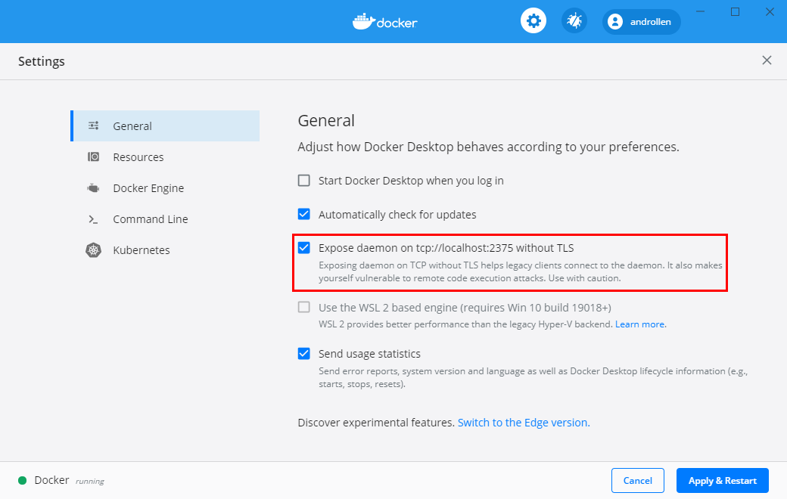
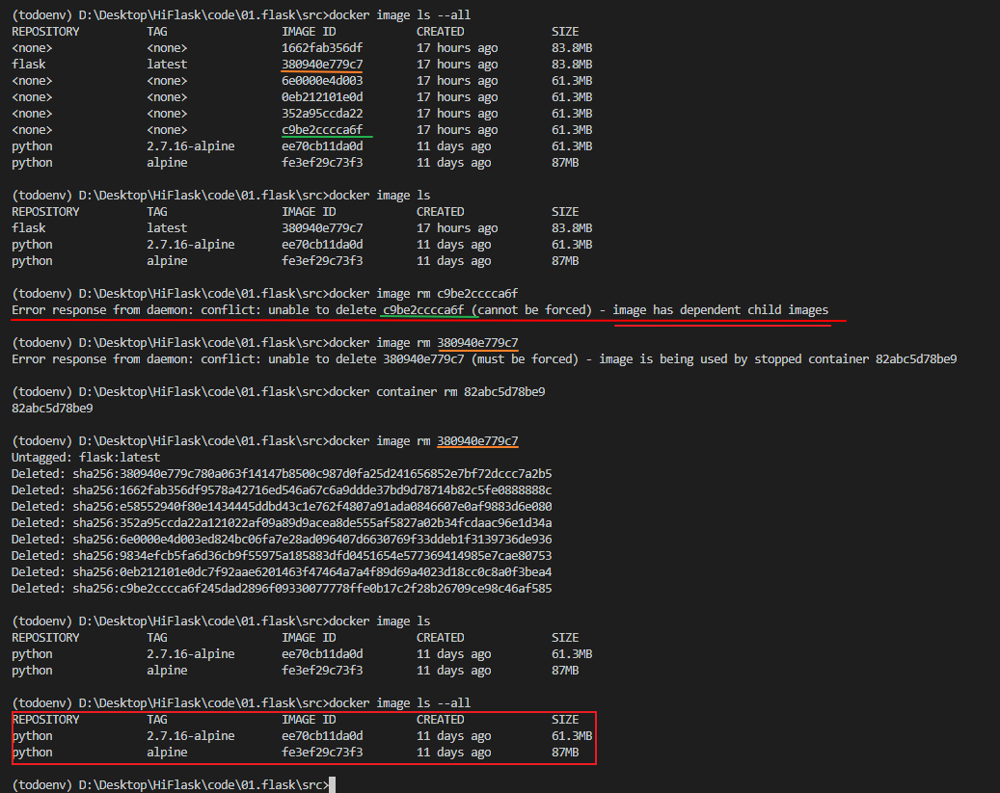

### 问题

- [Cannot connect to the Docker daemon at unix:///var/run/docker.sock. Is the docker daemon running?](https://blog.csdn.net/HOOKTTG/article/details/80626369)

  打开选项：  
  

  ```sh
  # 进入wsl,执行如下操作
  echo "export DOCKER_HOST='tcp://0.0.0.0:2375'" >> ~/.bashrc
  source ~/.bashrc
  docker version
  ```

- [Manage Docker as a non-root user](https://docs.docker.com/engine/install/linux-postinstall/)

  ```sh
  # Create the docker group
  sudo groupadd docker
  # Add your user to the docker group
  sudo usermod -aG docker $USER
  or
  sudo usermod -aG docker your-user
  ```

  如果是开虚拟机搭建的Linux这样操作

  ```sh
  sudo systemctl daemon-reload
  sudo systemctl restart docker
  ```

- Error response from daemon: conflict: unable to delete c9be2cccca6f (cannot be forced) - image has dependent child images  
  

- OSError: [Errno 8] Exec format error
  #!/usr/bin/env python
