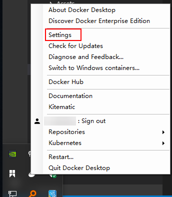
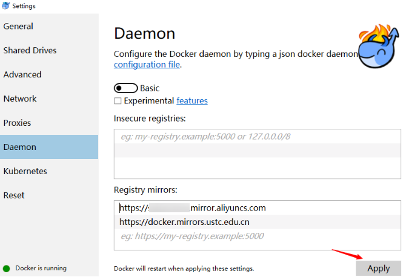
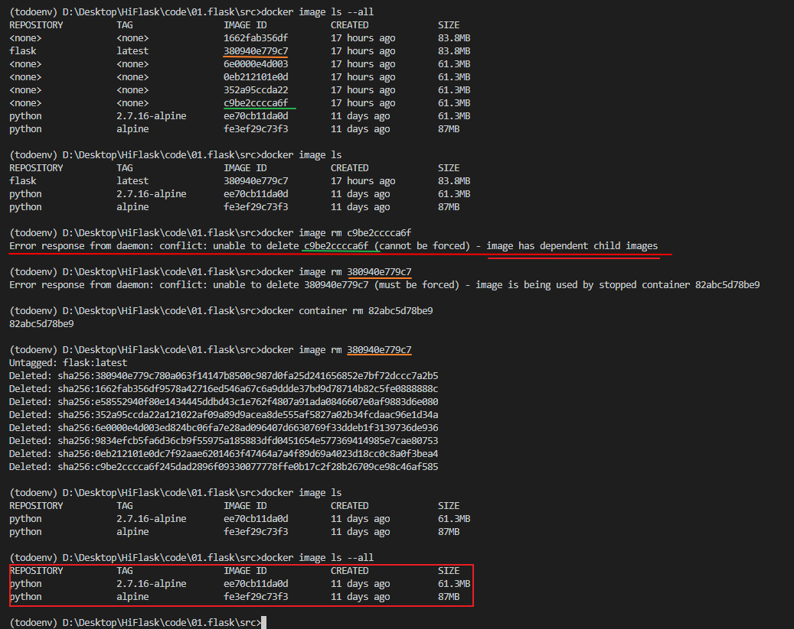

### 问题

- [Cannot connect to the Docker daemon at unix:///var/run/docker.sock. Is the docker daemon running?](https://blog.csdn.net/HOOKTTG/article/details/80626369)

  打开选项：  
  

  ```sh
  # 进入wsl,执行如下操作
  echo "export DOCKER_HOST='tcp://0.0.0.0:2375'" >> ~/.bashrc
  source ~/.bashrc
  docker version
  ```

- [Manage Docker as a non-root user](https://docs.docker.com/engine/install/linux-postinstall/)

  ```sh
  # Create the docker group
  sudo groupadd docker
  # Add your user to the docker group
  sudo usermod -aG docker $USER
  or
  sudo usermod -aG docker your-user
  ```

- 当创建 image 使用了这个命令出现了问题

  ```sh
  $ docker image build -t hiflask:0.0.1 .
  Sending build context to Docker daemon  168.4kB
  Step 1/5 : FROM node:8.4
  Get https://registry-1.docker.io/v2/: net/http: request canceled while waiting for connection (Client.Timeout exceeded while awaiting headers)
  ```

  可以去这里申请：  
  [容器Hub服务](https://cr.console.aliyun.com/cn-hangzhou/instances/mirrors)

  您可以参考以下配置步骤：
  在系统右下角托盘图标内右键菜单选择 Settings，打开配置窗口后左侧导航菜单选择 Docker Daemon。编辑窗口内的JSON串，填写下方加速器地址：  
  

  ```sh
  {
    "registry-mirrors": ["https://xxxx.mirror.aliyuncs.com"]
  }
  ```

    
  编辑完成后点击 Apply 保存按钮，等待Docker重启并应用配置的镜像加速器。

  如果是开虚拟机搭建的Linux这样操作

  ```sh
  sudo systemctl daemon-reload
  sudo systemctl restart docker
  ```

- Error response from daemon: conflict: unable to delete c9be2cccca6f (cannot be forced) - image has dependent child images
  

- OSError: [Errno 8] Exec format error
  #!/usr/bin/env python
