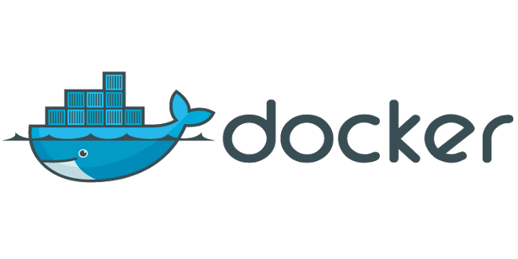

<h2 align="center">Docker入门教程</h2>

我们把远程服务器上部署好的环境 打包成一个容器，方便我们在未来的某个时刻某个空间一键部署我们的服务，web站点，安装包等等。

优点：

- 减少部署时间
- 方便快捷迁移
- 提升开发效率
- 隔离应用
- 整合服务器
- 调试能力
- 多租户环境

缺点：

- 开发部署问题
- 文件缓存过大
- 64位机器上运行

### 目录

- [Docker 介绍](01.Introduction.md)
- [Docker 安装](02.Install.md)
- [Docker 命令行](03.Command_Line.md)
- [Docker 三大组件](04.Containers_Images_Registries.md)
- [Docker 创建示例](05.Create_Sample_VSCode.md)
- [Docker 问答](99.QA.md)

### 相关链接
  
  <https://docs.docker.com/install/>  

  <https://docs.docker.com/get-started/>
  
  <https://github.com/yeasy/docker_practice>

  [阮一峰 Docker 入门教程](http://www.ruanyifeng.com/blog/2018/02/docker-tutorial.html)

  [Docker入门学习理解全记录](https://zhuanlan.zhihu.com/p/58436705)
  
  [runoob](https://www.runoob.com/docker/ubuntu-docker-install.html)
  
  [Docker 容器入门](https://www.cnblogs.com/clsn/p/8410309.html)

  [docker之安装和基本使用](https://www.cnblogs.com/cwp-bg/p/9365983.html)  
  
  [reboot 后 Docker服务及容器自动启动设置](https://blog.csdn.net/wxb880114/article/details/82904765)  

  [reboot 后 Docker服务及容器自动启动设置](https://blog.csdn.net/qq_28295425/article/details/86537124)

  <https://www.cnblogs.com/kaixinyufeng/p/9389348.html>
