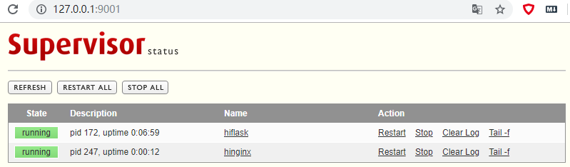

### 从头到尾搭建网站

1. 准备 flask Sample App
    ``` bash
    # 安装python3 pip
    sudo apt-get install python3-pip
    # 全局安装pipenv 使用pip3
    pip3 install -U pipenv
    # cd 到项目下
    cd /home/hiflask
    # 安装虚拟环境 指定 python3.6 版本
    pipenv --python3.6
    # 激活
    pipenv shell
    # 安装flask依赖
    pipenv install flask
    # 运行flask项目
    python3 run.py 
    # 退出开发模式
    ctrl + c
    ```

2. 准备 Supervisor
    ``` bash
    # 安装
    sudo apt-get install supervisor 
    # supervisord is  not running.
    sudo service supervisor status
    # Starting supervisor: supervisord.
    sudo service supervisor start
    # 切换到
    cd /etc/supervisor
    # 备份
    $ sudo cp supervisord.conf supervisord.conf.bak
    # 编辑
    sudo vi supervisord.conf
    # 添加
    [inet_http_server]
    port=127.0.0.1:9001
    username=user
    password=123    
    ```

3. 准备 Gunicorn
    ``` bash
    # cd to 到项目下
    cd /home/hiflask
    # 激活
    pipenv shell
    # 安装 gunicorn
    pipenv install gunicorn
    ```

4. 配置 Nginx
    ``` bash
    sudo apt-get install nginx
    # cd /etc/nginx
    sudo cp nginx.conf nginx.conf.bak
    # cd /etc/nginx/sites-available
    sudo cp default default.bak  
    # 查看是否开启  
    sudo service nginx status  
    # 开启
    sudo service nginx start  
    # 查找 nginx 文件夹
    sudo find / -type d -mount -name nginx
    # 
    cd /etc/nginx/sites-available  
    # 编辑
    sudo vi default 
    # 添加(拉到最下面 打开 # )
    server {
        # 你的服务器的端口
        listen 80;
        # 例如 192.168.101.76 你的服务器地址; 可以是域名，也可以写 ip 地址 
        server_name 192.168.101.76;

        location / {
                # 这个是Gunicorn与Ningx通信的端口。和Gunicorn的配置相同
                proxy_pass http://127.0.0.1:8000; 
                proxy_set_header Host $host;
                proxy_set_header X-Forwarded-For $proxy_add_x_forwarded_for;
                proxy_set_header X-Real-IP         $remote_addr;
                proxy_set_header X-Forwarded-Host  $host;
                proxy_set_header X-Forwarded-Port  $server_port;                
                access_log /var/log/nginx/access.log;
                error_log  /var/log/nginx/error.log;
                try_files $uri $uri/ =404;
        }
    }
    sudo service nginx restart  
    sudo service nginx status 
    http://127.0.0.1:5000 or http://192.168.101.76 
    ```
    这个时候 你可以使用你的 vps-IP地址 访问你的网站了

5. 使用 Supervisor 守护 Gunicorn 和 Nginx
    ``` bash
    # 切换到
    cd /etc/supervisor/conf.d/
    # copy to current dir
    cp /home/androllen/hiflask/gunicorn.conf .
    # copy to current dir
    cp /home/androllen/hiflask/nginx.conf .
    # 
    sudo supervisorctl update
    #
    sudo supervisorctl status
    # open browser
    http://127.0.0.1:9001
    ```
    [gunicorn.conf](Assets\gunicorn.conf)  

    [nginx.conf](\Assets\nginx.conf)  
    
    

6. 开启 80 443 端口  
     - [跳转到这里修改](../0x05-Nginx/04.Ufw_Cert.md)


7. 开启 nginx https 访问  
     - 确定开启443 端口  
     - 去阿里云或者腾讯云申请免费cert  
     - [跳转到这里修改](../0x05-Nginx/04.Ufw_Cert.md)
     - cd /etc/nginx/sites-available   
     - sudo vi default  
     - [跳转到这里修改](../0x05-Nginx/07.Nginx_Config.md)
     - 重启 service Nginx reload 
  
开始访问吧!  [https://www.achinesepainter.com/](https://www.achinesepainter.com/)

***到这里基本流程结束，下一次会带大家一起学习 flask ***


