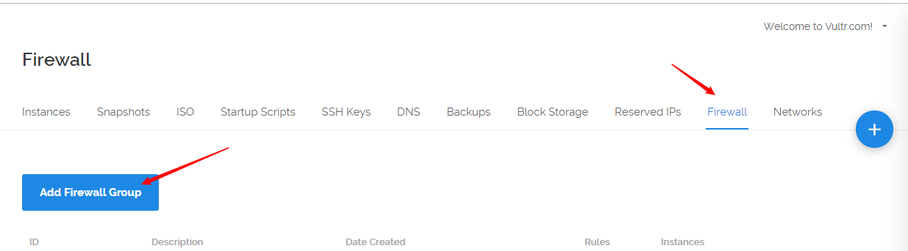
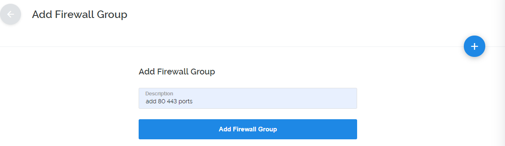
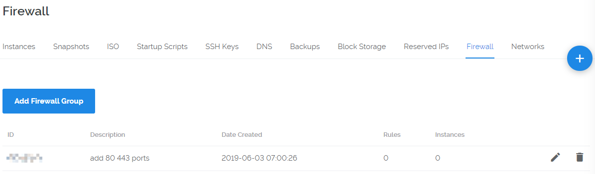
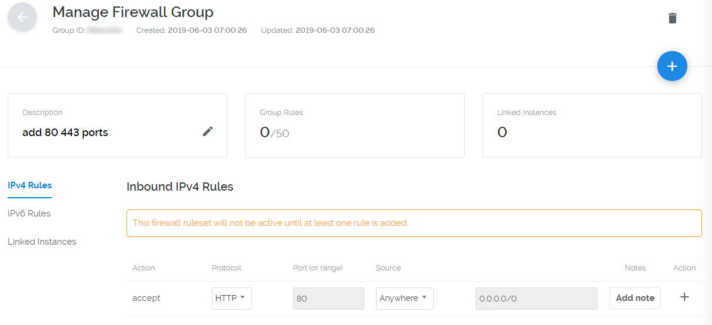
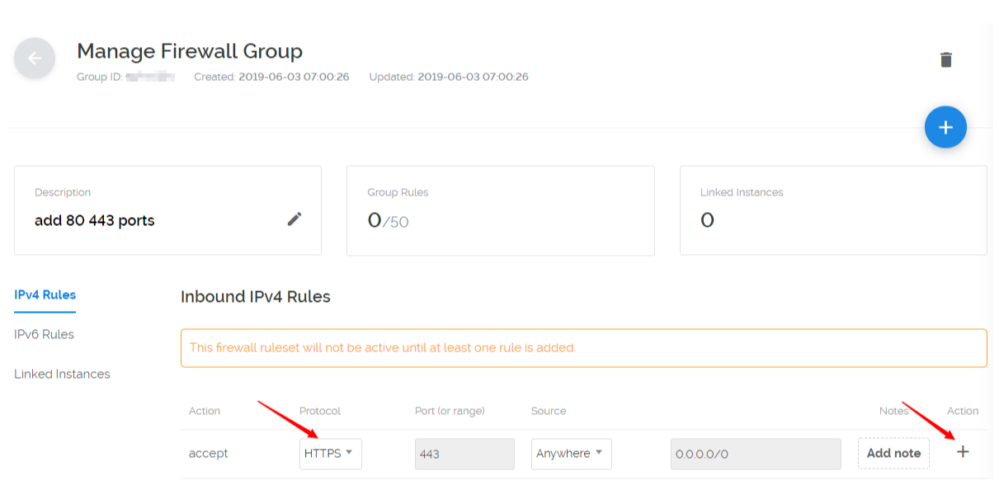
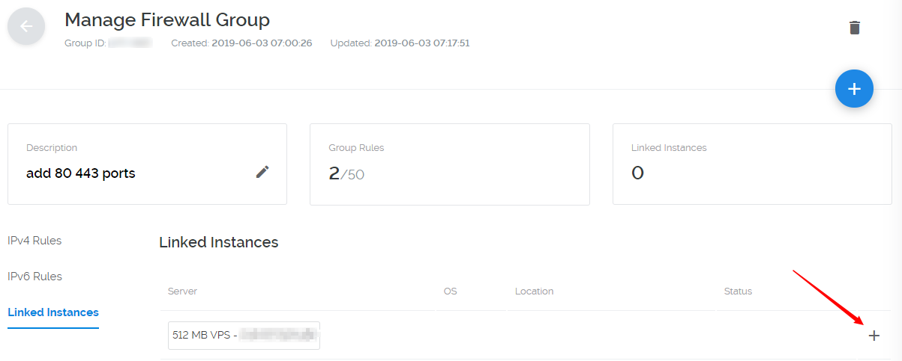
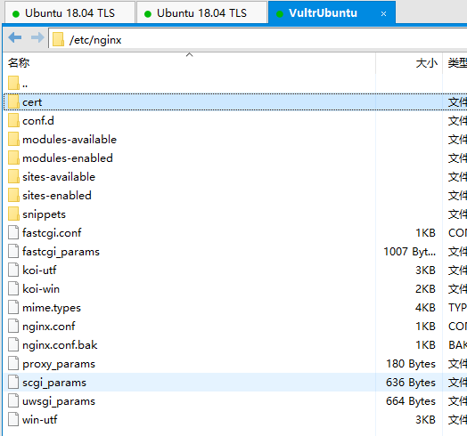
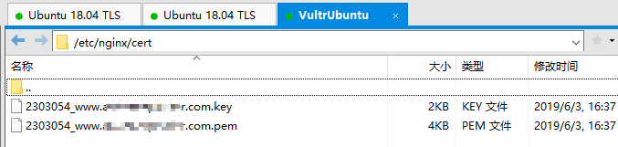

### 从头到尾搭建网站

1. 准备 flask Sample App
    ``` bash
    # 安装python3 pip
    sudo apt-get install python3-pip
    # 全局安装pipenv 使用pip3
    pip3 install -U pipenv
    # cd 到项目下
    cd /home/hiflask
    # 安装虚拟环境 指定 python3.6 版本
    pipenv --python3.6
    # 激活
    pipenv shell
    # 安装flask依赖
    pipenv install flask
    # 运行flask项目
    python3 run.py 
    # 退出开发模式
    ctrl + c
    ```

2. 准备 Supervisor
    ``` bash
    # 安装
    sudo apt-get install supervisor 
    # supervisord is  not running.
    sudo service supervisor status
    # Starting supervisor: supervisord.
    sudo service supervisor start
    # 切换到
    cd /etc/supervisor
    # 备份
    $ sudo cp supervisord.conf supervisord.conf.bak
    # 编辑
    sudo vi supervisord.conf
    # 添加
    [inet_http_server]
    port=127.0.0.1:9001
    username=user
    password=123    
    ```

3. 准备 Gunicorn
  ``` bash
  # cd to 到项目下
  cd /home/hiflask
  # 激活
  pipenv shell
  # 安装 gunicorn
  pipenv install gunicorn
  ```

4. 配置 Nginx
  ``` bash
  sudo apt-get install nginx
  # cd /etc/nginx
  sudo cp nginx.conf nginx.conf.bak
  # cd /etc/nginx/sites-available
  sudo cp default default.bak  
  # 查看是否开启  
  sudo service nginx status  
  # 开启
  sudo service nginx start  
  # 查找 nginx 文件夹
  sudo find / -type d -mount -name nginx
  # 
  cd /etc/nginx/sites-available  
  # 编辑
  sudo vi default 
  # 添加(拉到最下面 打开 # )
  server {
      # 你的服务器的端口
      listen 80;
      # 例如 192.168.101.76 你的服务器地址; 可以是域名，也可以写 ip 地址 
      server_name 192.168.101.76;

      location / {
              # 这个是Gunicorn与Ningx通信的端口。和Gunicorn的配置相同
              proxy_pass http://127.0.0.1:8000; 
              proxy_set_header Host $host;
              proxy_set_header X-Forwarded-For $proxy_add_x_forwarded_for;
              proxy_set_header X-Real-IP         $remote_addr;
              proxy_set_header X-Forwarded-Host  $host;
              proxy_set_header X-Forwarded-Port  $server_port;                
              access_log /var/log/nginx/access.log;
              error_log  /var/log/nginx/error.log;
              try_files $uri $uri/ =404;
      }
  }
  sudo service nginx restart  
  sudo service nginx status 
  http://127.0.0.1:5000 or http://192.168.101.76 
  ```
  这个时候 你可以使用你的 vps-IP地址 访问你的网站了

5. 使用 Supervisor 守护 Gunicorn 和 Nginx
  ``` bash
  # 切换到
  cd /etc/supervisor/conf.d/
  # copy to current dir
  cp /home/androllen/hiflask/gunicorn.conf .
  # copy to current dir
  cp /home/androllen/hiflask/nginx.conf .
  # 
  sudo supervisorctl update
  #
  sudo supervisorctl status
  # open browser
  http://127.0.0.1:9001
  ```
  [gunicorn.conf](Assets\gunicorn.conf)

  [nginx.conf](\Assets\nginx.conf)

6. 开启 80 443 端口  
  - 打开 vultr 在控制台选择->firewall->add friewall group,添加一套防火墙规则  
      

  -  给这个防火墙规则命名  
      
      

  - 添加 80、443 端口，protocol 选择 http，点击加号，添加 80 端口；protocol 选择 https，点击加号，添加 443 端口  
      
      

  - 将这套防火墙规则应用到 vps 主机，选择 linked instances,选择你要开启端口的 vps，然后点击加号即可 
       

  - 在 vps 主机中配置 ubuntu 主机开放 80、443 端口
    ``` bash
    sudo ufw allow 80
    sudo ufw allow 443
    sudo ufw status
    sudo ufw reload
    
    sudo ufw disable
    sudo ufw enable
    ```


7. 开启 nginx https 访问  
  - 确定开启443 端口  
  - 去阿里云或者腾讯云申请免费cert  
    
    
  - cd /etc/nginx/sites-available   
  - sudo vi default  
  ``` bash
  server {                                                                      
      listen         443 ssl;                                                  
      server_name    www.achinesepainter.com;                          
      ssl_certificate      cert/2303054_www.achinesepainter.com.pem;     
      ssl_certificate_key  cert/2303054_www.achinesepainter.com.key;             
      
      root /var/www/html;
      #s储存SSL会话的缓存类型和大小                                                                   
      ssl_session_cache    shared:SSL:1m;                         
      ssl_session_timeout 5m; 
      ssl_protocols TLSv1 TLSv1.1 TLSv1.2; 
      #为建立安全连接，服务器所允许的密码格式列表 
      ssl_ciphers ECDHE-RSA-AES128-GCM-SHA256:ECDHE:ECDH:AES:HIGH:!NULL:!aNULL:!MD5:!ADH:!RC4;
      #依赖SSLv3和TLSv1协议的服务器密码将优先于客户端密码
      ssl_prefer_server_ciphers  on; 
                                              
      location /     {                                                 
              root     /var/www/;                               
              index    index.html index.htm index.php;                           
      }                                                                
  }    
  ```
  - 将http访问自动跳转到https
  ``` bash
  server{
    listen 80;
    # 域名
    server_name achinesepainter.com;
    rewrite  ^/(.*)$ https://www.achinesepainter.com/$1 permanent;
  }
  ```
  全部 default
  ``` bash
  ##
  # You should look at the following URL's in order to grasp a solid understanding
  # of Nginx configuration files in order to fully unleash the power of Nginx.
  # https://www.nginx.com/resources/wiki/start/
  # https://www.nginx.com/resources/wiki/start/topics/tutorials/config_pitfalls/
  # https://wiki.debian.org/Nginx/DirectoryStructure
  #
  # In most cases, administrators will remove this file from sites-enabled/ and
  # leave it as reference inside of sites-available where it will continue to be
  # updated by the nginx packaging team.
  #
  # This file will automatically load configuration files provided by other
  # applications, such as Drupal or Wordpress. These applications will be made
  # available underneath a path with that package name, such as /drupal8.
  #
  # Please see /usr/share/doc/nginx-doc/examples/ for more detailed examples.
  ##

  # Default server configuration
  #
  server {
    #listen 80 default_server;
    #listen [::]:80 default_server;

    # SSL configuration
    listen 443 ssl;

    server_name www.achinesepainter.com;
    
    ssl_certificate      cert/2303054_www.achinesepainter.com.pem;     
          ssl_certificate_key  cert/2303054_www.achinesepainter.com.key;    
          # 储存SSL会话的缓存类型和大小
          ssl_session_cache    shared:SSL:1m;                         
          ssl_session_timeout 5m; 
          ssl_protocols TLSv1 TLSv1.1 TLSv1.2; 
          # 为建立安全连接，服务器所允许的密码格式列表
          ssl_ciphers ECDHE-RSA-AES128-GCM-SHA256:ECDHE:ECDH:AES:HIGH:!NULL:!aNULL:!MD5:!ADH:!RC4; 
          # 依赖SSLv3和TLSv1协议的服务器密码将优先于客户端密码
          ssl_prefer_server_ciphers  on; 

    location / {
      # First attempt to serve request as file, then
      # as directory, then fall back to displaying a 404.
      try_files $uri $uri/ =404;
    }

    # listen [::]:443 ssl default_server;
    #
    # Note: You should disable gzip for SSL traffic.
    # See: https://bugs.debian.org/773332
    #
    # Read up on ssl_ciphers to ensure a secure configuration.
    # See: https://bugs.debian.org/765782
    #
    # Self signed certs generated by the ssl-cert package
    # Don't use them in a production server!
    #
    # include snippets/snakeoil.conf;

    #root /var/www/html;

    # Add index.php to the list if you are using PHP
    #index index.html index.htm index.nginx-debian.html;

    # pass PHP scripts to FastCGI server
    #
    #location ~ \.php$ {
    #	include snippets/fastcgi-php.conf;
    #
    #	# With php-fpm (or other unix sockets):
    #	fastcgi_pass unix:/var/run/php/php7.0-fpm.sock;
    #	# With php-cgi (or other tcp sockets):
    #	fastcgi_pass 127.0.0.1:9000;
    #}

    # deny access to .htaccess files, if Apache's document root
    # concurs with nginx's one
    #
    #location ~ /\.ht {
    #	deny all;
    #}
  }


  # Virtual Host configuration for example.com
  #
  # You can move that to a different file under sites-available/ and symlink that
  # to sites-enabled/ to enable it.
  #
  server {
    listen 80;

    server_name www.achinesepainter.com;

    rewrite  ^/(.*)$ https://www.achinesepainter.com/$1 permanent;  

    location / {
                  proxy_pass http://127.0.0.1:5000; 
                  proxy_set_header Host $host;
                  proxy_set_header X-Forwarded-For $proxy_add_x_forwarded_for;
                  proxy_set_header X-Real-IP         $remote_addr;
                  proxy_set_header X-Forwarded-Host  $host;
                  proxy_set_header X-Forwarded-Port  $server_port;                
                  access_log /var/log/nginx/access.log;
                  error_log  /var/log/nginx/error.log;
      try_files $uri $uri/ =404;
    }
  }

  ```
  [https://www.achinesepainter.com/](https://www.achinesepainter.com/)


8.  测试
  ``` bash
  # 外来访问默认允许/拒绝
  ufw default allow/deny
  # 允许/拒绝 访问20端口,20后可跟/tcp或/udp，表示tcp或udp封包。
  ufw allow/deny 20
  # ufw从/etc/services中找到对应service的端口，进行过滤。
  ufw allow/deny servicename
  # 允许自10.0.1.0/10的tcp封包访问本机的25端口。
  ufw allow proto tcp from 10.0.1.0/10 to 本机ip port 25
  # 删除以前定义的"允许/拒绝访问20端口"的规则
  ufw delete allow/deny 20
  ```
  https://www.cnblogs.com/OnlyDreams/p/7210914.html
